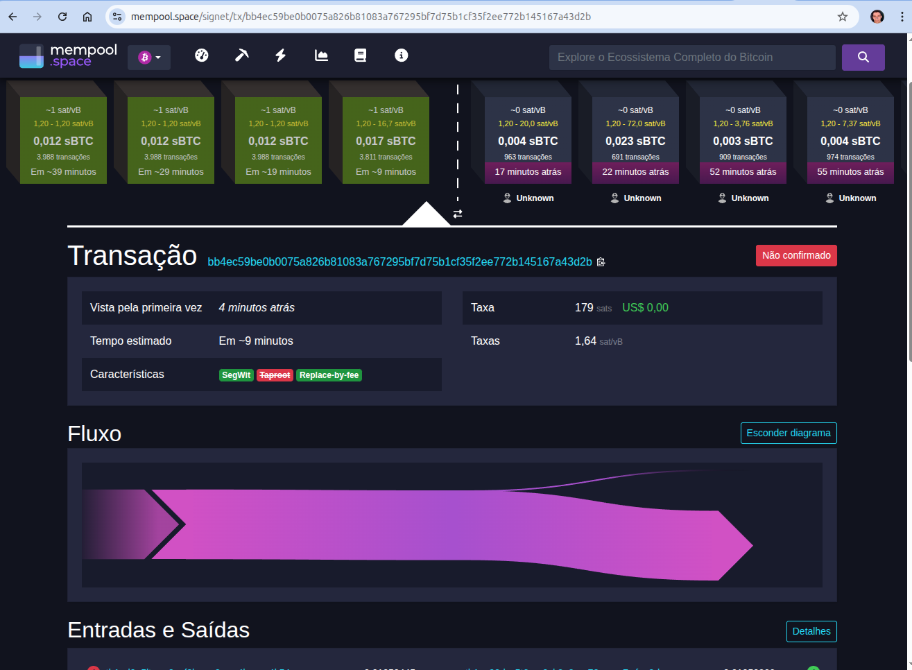
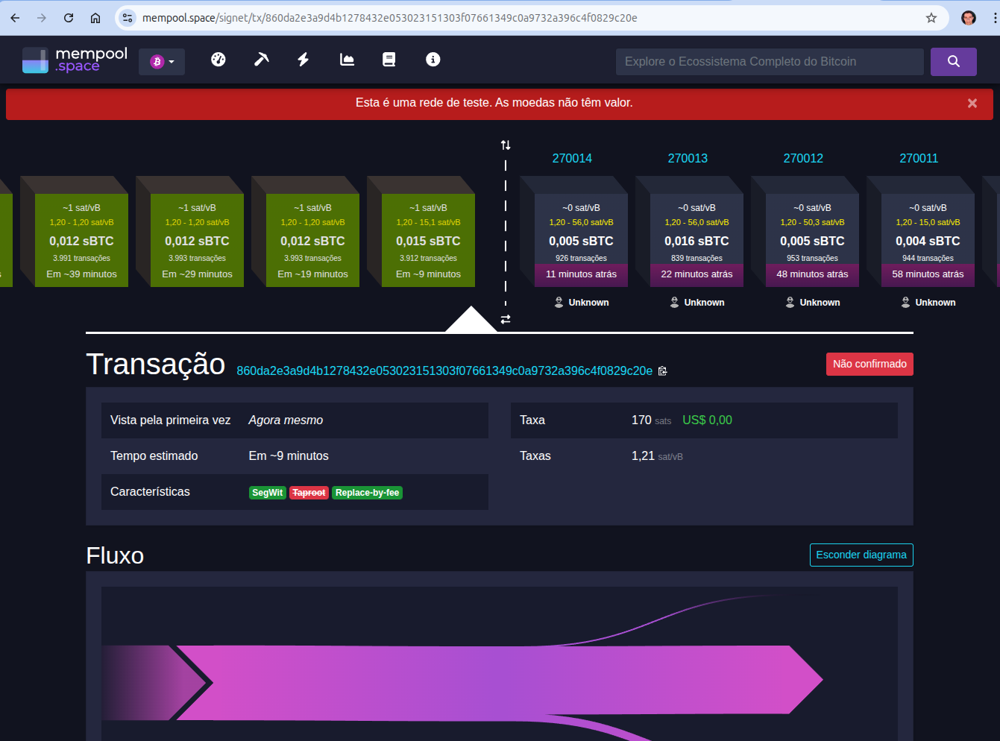
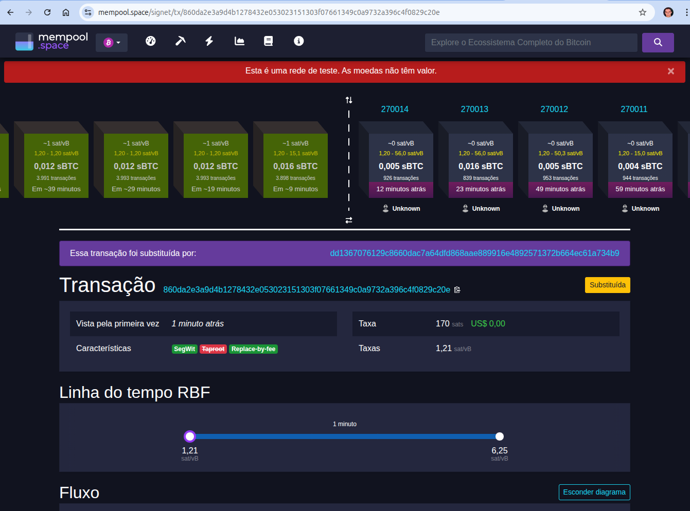
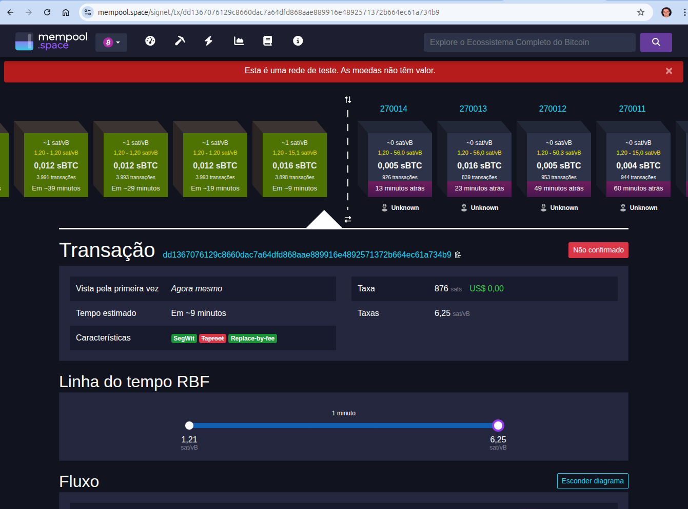

# Taxas, Mempool e Estratégias de Confirmação

por Rafael Santos

Atualizado em: 17/09/2025 ∙ 30 min leitura

Antes de qualquer transação Bitcoin ser incluída em um bloco, ela precisa “aguardar sua vez” em um espaço temporário chamado **mempool** (memory pool).

Cada *full node* mantém o **seu próprio mempool**, que funciona como uma sala de espera descentralizada: assim que uma transação é recebida pela rede e passa nas regras de validação, ela entra nessa fila local aguardando um minerador selecioná-la.

Essa etapa é crucial por três motivos:

1. **Prioridade por taxa:** mineradores tendem a escolher as transações que pagam a maior *fee rate* (sat/vByte), pois o espaço do bloco é limitado a cerca de **1 MB / 4 MWU**.
2. **Políticas individuais:** cada node define regras para aceitar ou descartar transações (limite de tamanho, tempo de expiração, taxa mínima). Isso significa que **não existe um mempool global** e que dois nodes podem ter conjuntos de transações ligeiramente diferentes.
3. **Impacto no usuário:** entender como o mempool funciona ajuda a prever tempo de confirmação e a pagar a taxa adequada, evitando tanto atrasos quanto gastos desnecessários.

Com um node em execução, é simples inspecionar o mempool:

```bash
bitcoin-cli -datadir="." getmempoolinfo
{
  "loaded": true,
  "size": 28,
  "bytes": 4428,
  "usage": 36656,
  "total_fee": 0.00019627,
  "maxmempool": 300000000,
  "mempoolminfee": 0.00001000,
  "minrelaytxfee": 0.00001000,
  "incrementalrelayfee": 0.00001000,
  "unbroadcastcount": 0,
  "fullrbf": true
}
```

Esse comando retorna estatísticas em tempo real, como:

- **size**: número de transações na fila
- **bytes**: tamanho total em bytes
- **mempoolminfee**: taxa mínima para entrada no seu node

Para ver as transações que estão na mempool do seu node, podemos usar o comando `getrawmempool`:

```bash
bitcoin-cli -datadir="." getrawmempool
[
  "cb32e0898f13c22cc1ea10c19186061af4142ef9a9346e819fb3c5d163ef83f0",
  "ea4ac5ba54d5818fdcaceef8e000e0fbb4703f5ccf791e79cfc8b44e441a82d0",
  "8844905321457cdc3002386b215c537429de5917dfd555bbd1056b99a80fa94d",
  "63f1259557eab13b378e1f62dde7294042054ebb75f108075397b7f260225b8f",
  ...
  "d32d62cfcd8c0c5bf14d7841c8cd17d368ce81206ce5126905619857f3ee6072",
  "8802450b20bfbb0116056fb5ba83b2a0a18e5087195589a4f764fc0d090c2fce",
  "56776ab78dd291cd7d892fb03dd399c108675dfe2784e047e8ceead76521c342",
  "b44232929719aab4f5da25970ab95da5a7a7780a367774b62ad6f0287b94f3bd"
]
```

Retorna, por padrão, **um array com os `txid`** de **todas as transações atualmente aceitas no mempool** do seu **node. Cada item da lista é o identificador único (hash) de uma transação pendente de confirmação.

Para ver **detalhes de uma transação específica** (taxa, tamanho, dependências, etc.), podemos usar o comando `getmempoolentry`:

```bash
bitcoin-cli -datadir="." getmempoolentry b44232929719aab4f5da25970ab95da5a7a7780a367774b62ad6f0287b94f3bd
{
  "vsize": 9188,
  "weight": 36752,
  "time": 1758027406,
  "height": 269871,
  "descendantcount": 1,
  "descendantsize": 9188,
  "ancestorcount": 25,
  "ancestorsize": 11852,
  "wtxid": "37da7990998a2381049d03fe48bad8ae048d5f50f93ea9ba4ea26116404a5133",
  "fees": {
    "base": 0.00123248,
    "modified": 0.00123248,
    "ancestor": 0.00130952,
    "descendant": 0.00123248
  },
  "depends": [
    "56776ab78dd291cd7d892fb03dd399c108675dfe2784e047e8ceead76521c342"
  ],
  "spentby": [
  ],
  "bip125-replaceable": true,
  "unbroadcast": false
}

```

Lembrando: esse é o **mempool local** do seu node. Outros nodes podem ter conjuntos diferentes de transações, já que não existe um mempool global sincronizado.

Essa visão teórica e prática inicial é o ponto de partida para compreender o restante do artigo: como estimar taxas, ajustar confirmações e interagir com o mempool de forma eficiente.

**Lembrete**: estaremos utilizando neste artigo a `signet`.

---

## Estimando as taxas (`estimatesmartfee`)

Antes de enviar uma transação, é fundamental escolher uma **taxa (fee)** adequada. Uma taxa muito baixa pode deixar a transação “presa” no mempool por horas ou dias; uma taxa muito alta significa gastar satoshis desnecessariamente. O Bitcoin Core ajuda a encontrar o equilíbrio por meio do comando **`estimatesmartfee`**.

Algumas informações importantes:

- **Taxa depende de congestionamento**
    
    Quanto mais transações competem por espaço, maior o preço por byte (*fee rate*, em **satoshis por vByte**).
    
    A lógica é simples: mineradores priorizam quem paga mais por cada unidade de espaço.
    
- **Histórico de confirmações**
    
    O Core analisa blocos recentes para prever a taxa mínima que provavelmente fará sua transação ser confirmada dentro de um certo número de blocos.
    
- **Parâmetro *target***
    
    É o número de blocos desejado para confirmação.
    
    *Exemplo:* target `6` significa “quero que confirme em até 6 blocos (~1 hora)”.
    
- **Feerate**
    
    O retorno é dado em **BTC por kB**.
    
    Para converter em **sat/vB**, multiplique por `100000000` (satoshis por BTC) e divida por `1000` (bytes por kB).
    

Consulta padrão para confirmação em até **6 blocos**:

```bash
bitcoin-cli -datadir="." estimatesmartfee 6
{
  "feerate": 0.00001271,
  "blocks": 6
}
```

- `feerate`: taxa sugerida em **BTC/kB**.
- `blocks`: quantidade de blocos estimada para confirmação.

Você verá que quanto **menor o número de blocos**, **maior a taxa** recomendada. Cabe salientar que na signet/testnet a produção de blocos é irregular e não tem muita disputa, o que provavelmente irá produzir taxas parecidas ou iguais em muitos casos.

---

## **Definindo a taxa de uma transação no Bitcoin Core**

No Bitcoin, a taxa (*fee*) não é um campo explícito, ela é sempre a diferença entre o valor total das entradas (*inputs*) e das saídas (*outputs*). O Bitcoin Core permite três formas principais de determinar essa taxa.

### **1️⃣ Cenário: Comandos simples (`sendtoaddress`, `sendmany`)**

Quando você utiliza os comandos de envio direto, não precisa calcular nada manualmente.

O Core:

1. Consulta internamente o `estimatesmartfee` para o *conf_target* padrão (normalmente 6 blocos).
2. Seleciona automaticamente os UTXOs necessários.
3. Cria o troco e **aplica a fee total adequada** com base na *feerate* estimada.

Exemplo:

```bash
bitcoin-cli sendtoaddress tb1qdestino... 0.005
```

Aqui não informamos a taxa: o Core define tudo para que a transação seja confirmada no prazo esperado.

### **2️⃣ Cenário: Comandos brutos com cálculo automático (`fundrawtransaction`, `sendrawtransaction`)**

Quando você cria uma transação bruta, pode deixar o Core calcular a taxa ou especificar o alvo de confirmação ou a feerate:

- **Confirmação por blocos**

```bash
bitcoin-cli fundrawtransaction <hex> '{"conf_target":6}'
```

O Core usa o `estimatesmartfee` para encontrar a taxa adequada para 6 blocos.

**Feerate manual (sat/vB)**

```bash
bitcoin-cli fundrawtransaction <hex> '{"feeRate":1.5}'
```

Aqui você define a feerate em sat/vB e o Core multiplica pelo tamanho da transação, ajustando o output de troco para que a **fee total** corresponda.

Em ambos os casos, a taxa final é aplicada automaticamente ao valor de troco.

### **3️⃣ Cenário: Taxa implícita (entradas – saídas)**

No modo totalmente manual, **a taxa é simplesmente a diferença entre inputs e outputs**.

Você calcula a *feerate* desejada com `estimatesmartfee`, estima o tamanho da transação e escolhe o valor dos outputs. 

**🔹 Exemplo Prático – Usando um UTXO**

Primeiro podemos listar nossos UTXOs disponíveis:

```bash
bitcoin-cli -datadir="." listunspent
[
  {
    "txid": "a96b10fcf4e2679e3dea4c49013a1370f75a6c50ecc7003cc5104d1b68dba7f4",
    "vout": 0,
    "address": "tb1ql7xhs9uf9sqtz7xca5lvup6m5t5zyw5cseh2w8",
    "label": "destinatario",
    "scriptPubKey": "0014ff8d7817892c00b178d8ed3ece075ba2e8223a98",
    "amount": 0.00050000,
    "confirmations": 2331,
    "spendable": true,
    "solvable": true,
    "desc": "wpkh([7746de77/84h/1h/0h/0/1]02f42f2f7937b16be48aa5b6e8bdb8379a21803e4a64d2ddcb8aec571e6af4ef4b)#ze0s3syp",
    "parent_descs": [
      "wpkh(tpubD6NzVbkrYhZ4Xy5JXkPzYUK6CkFLivGB6j2WUtPr47B6iKLoqPFCCufvXSPLdpmrcmdV3GEWe4ht8UCjwHgQHwPVJHdqExHPnMatfvhu81Q/84h/1h/0h/0/*)#6wyhgtkz"
    ],
    "safe": true
  },
  {
    "txid": "a96b10fcf4e2679e3dea4c49013a1370f75a6c50ecc7003cc5104d1b68dba7f4",
    "vout": 1,
    "address": "tb1qd0e5ltwcp0xuf8lwrav8pgrr4kqvua4k54xryg",
    "scriptPubKey": "00146bf34fadd80bcdc49fee1f5870a063ad80ce76b6",
    "amount": 0.01050445,
    "confirmations": 2331,
    "spendable": true,
    "solvable": true,
    "desc": "wpkh([7746de77/84h/1h/0h/1/0]027fcd8a0fcbb800782abfe6f2b5937dd35ad2cf67df1d1ab422915b4a44b5ff8d)#sgkmnw58",
    "parent_descs": [
      "wpkh(tpubD6NzVbkrYhZ4Xy5JXkPzYUK6CkFLivGB6j2WUtPr47B6iKLoqPFCCufvXSPLdpmrcmdV3GEWe4ht8UCjwHgQHwPVJHdqExHPnMatfvhu81Q/84h/1h/0h/1/*)#t6pk47x6"
    ],
    "safe": true
  }
]
```

Perceba que, no nosso exemplo, temos 2 UTXOs. Vamos gastar o  segundo UTXO, de **0.01050445 BTC**:

Suponha que queremos enviar quase tudo para o endereço de destino

```
tb1qc98dvc5t6era0zk2n2ww73yrv5k5tj7wfgu3de
```

e deixar a taxa implícita.

**1. Estimar a taxa necessária**

Consultamos o Core para uma confirmação em ~6 blocos:

```bash
bitcoin-cli -datadir="." estimatesmartfee 6
{
  "feerate": 0.00001272,
  "blocks": 6
}
```

0.00001272 BTC/kB ≈ **1.272 sat/vB**

(0.00001272 × 100 000 000 ÷ 1000)

**2. Prever o tamanho da transação**

Transação com **1 input e 1 output** no formato SegWit P2WPKH costuma ter ~141 vbytes.

(Para confirmar, você pode criar a transação bruta e rodar `decoderawtransaction`).

**3. Calcular a fee total**

```
fee_total = feerate × tamanho
fee_total ≈ 1.272 sat/vB × 141 vB ≈ 179 satoshis
```

179 sat = **0.00000179 BTC**.

**4. Definir o valor de saída**

Total de inputs: **0.01050445 BTC**

Taxa desejada: **0.00000179 BTC**

Valor a enviar:

```
0.01050445 – 0.00000179 = 0.01050266 BTC
```

**5. Montar, assinar e enviar a transação bruta**

```bash
bitcoin-cli -datadir="." createrawtransaction   '[{"txid":"a96b10fcf4e2679e3dea4c49013a1370f75a6c50ecc7003cc5104d1b68dba7f4","vout":1}]'   '{"tb1qc98dvc5t6era0zk2n2ww73yrv5k5tj7wfgu3de":0.01050266}'
# 0200000001f4a7db681b4d10c53c00c7ec506c5af770133a01494cea3d9e67e2f4fc106ba90100000000fdffffff019a06100000000000160014c14ed6628bd647d78aca9a9cef4483652d45cbce00000000
```

Assinar:

```bash
bitcoin-cli -datadir="." signrawtransactionwithwallet 0200000001f4a7db681b4d10c53c00c7ec506c5af770133a01494cea3d9e67e2f4fc106ba90100000000fdffffff019a06100000000000160014c14ed6628bd647d78aca9a9cef4483652d45cbce00000000
{
  "hex": "02000000000101f4a7db681b4d10c53c00c7ec506c5af770133a01494cea3d9e67e2f4fc106ba90100000000fdffffff019a06100000000000160014c14ed6628bd647d78aca9a9cef4483652d45cbce02473044022048fe1c58540995aec2950227354e8721eb59c674921209e3bb9a544aeb49837c022074c33d509f9c5499d4e131c35ce1f6b78642d8ee04a1a00628cdb1c83a5b2da20121027fcd8a0fcbb800782abfe6f2b5937dd35ad2cf67df1d1ab422915b4a44b5ff8d00000000",
  "complete": true
}
```

Enviar:

```bash
bitcoin-cli -datadir="." sendrawtransaction 02000000000101f4a7db681b4d10c53c00c7ec506c5af770133a01494cea3d9e67e2f4fc106ba90100000000fdffffff019a06100000000000160014c14ed6628bd647d78aca9a9cef4483652d45cbce02473044022048fe1c58540995aec2950227354e8721eb59c674921209e3bb9a544aeb49837c022074c33d509f9c5499d4e131c35ce1f6b78642d8ee04a1a00628cdb1c83a5b2da20121027fcd8a0fcbb800782abfe6f2b5937dd35ad2cf67df1d1ab422915b4a44b5ff8d00000000
# bb4ec59be0b0075a826b81083a767295bf7d75b1cf35f2ee772b145167a43d2b
```

Após enviar podemos conferir na mempool “oficial” da signet e esperamos a confirmação da transação em bloco:



Perceba que nossa transação foi encontrada e já está em mempool fora de nossa node. Veja que já mostra a taxa de 179 sats.
Esse é o modo mais manual possível: você calcula a *feerate* com `estimatesmartfee`, estima o tamanho da transação e escolhe as saídas de forma que a diferença corresponda à taxa desejada. O node valida e, se o mempool aceitar, a transação segue para os mineradores.

---

## **RBF e CPFP na prática**

Quando uma transação fica presa na mempool por ter uma taxa muito baixa, o Bitcoin Core oferece dois mecanismos diferentes para “destravar” a confirmação: **Replace-by-Fee (RBF)** e **Child-Pays-for-Parent (CPFP)**.

**Replace-by-Fee (RBF)**

- Permite retransmitir **a mesma transação** com uma taxa maior.
- O node e os mineradores aceitam substituir a transação antiga pela nova, desde que a nova pague uma *feerate* mais alta.
- É necessário que a transação original tenha sido marcada como RBF no momento da criação.

**Child-Pays-for-Parent (CPFP)**

- Em vez de substituir a transação original, cria-se uma **transação filha** que gasta o output ainda não confirmado da transação “mãe”.
- A filha inclui uma taxa tão alta que, quando o minerador inclui as duas juntas no bloco, a média de taxas compensa o baixo valor da transação mãe.
- Não exige que a transação original tenha sido marcada como RBF.

Vamos ver na prática os 2 casos.

**A. Replace-by-Fee (RBF)**

1. **Criar a transação com RBF habilitado**

Ao enviar, ative o modo substituível:

```bash
bitcoin-cli -datadir="." -named sendtoaddress address="tb1qmx7xn97urd2lmmthju57l4f459f5dngwv2gm5l" amount=0.001 replaceable=true
# 860da2e3a9d4b1278432e053023151303f07661349c0a9732a396c4f0829c20e
```

- **Observação**: o `-named` é apenas uma forma de passar os parâmetros nomeados ao invés de seguir uma ordem.

Podemos ver na imagem abaixo a transação (com seu txid) esperando na mempool:



Perceba que a taxa definida foi 170 sats.

1. **Aumentar a taxa**

Utilize o comando `bumpfee` para aumentar a taxa da transação: 

```bash
bitcoin-cli -datadir="." bumpfee 860da2e3a9d4b1278432e053023151303f07661349c0a9732a396c4f0829c20e
{
  "txid": "dd1367076129c8660dac7a64dfd868aae889916e4892571372b664ec61a734b9",
  "origfee": 0.00000170,
  "fee": 0.00000876,
  "errors": [
  ]
}

```

O Core cria uma nova transação com *feerate* maior, assina e retransmite, substituindo a anterior no mempool. Observe que o comando retorna um novo txid com uma nova taxa (`0.00000876`). Veja que a mempool percebe que há uma transação substituta e avisa:



E vemos então que essa nova transação entra na mempool aguardando para ser confirmada.



**B. Child-Pays-for-Parent (CPFP)**
1. **Criar uma transação para ter um UTXO não confirmado**

```bash
bitcoin-cli -datadir="." sendtoaddress "tb1qh3lzqn5rzyan70k2e8epshx7a2av03r6hkdpns" 0.001
# 7dd5cad8da21f1a11ad8276d057dbe9c51afcacebdace4f53aa252d1f72d262d
```

Você pode conferir os UTXOs não confirmado com o comando:

```bash
bitcoin-cli -datadir="." listunspent 0 0
```

1. **Criar a transação filha com taxa alta**

Use o UTXO não confirmado como input e construa uma nova transação:

```bash
bitcoin-cli -datadir="." createrawtransaction   '[{"txid":"7dd5cad8da21f1a11ad8276d057dbe9c51afcacebdace4f53aa252d1f72d262d", "vout":0}]'   '{"tb1q2keg0wletfvtpl0r9n90ygt53rwptsuka3s343":0.000009}'
# 02000000012d262df7d152a23af5e4acbdcecaaf519cbe7d056d27d81aa1f121dad8cad57d0000000000fdffffff01840300000000000016001455b287bbf95a58b0fde32ccaf2217488dc15c39600000000
```

1. **Completar a transação com taxa elevada e assinar**

```bash
bitcoin-cli -datadir="." fundrawtransaction 02000000012d262df7d152a23af5e4acbdcecaaf519cbe7d056d27d81aa1f121dad8cad57d0000000000fdffffff01840300000000000016001455b287bbf95a58b0fde32ccaf2217488dc15c39600000000 '{"feeRate":0.00002500}'
{
  "hex": "02000000012d262df7d152a23af5e4acbdcecaaf519cbe7d056d27d81aa1f121dad8cad57d0000000000fdffffff020e810100000000001600142df348fba1d5f17c0d9ba936d79a296a4d4d2143840300000000000016001455b287bbf95a58b0fde32ccaf2217488dc15c39600000000",
  "fee": 0.00000526,
  "changepos": 0
}
```

```bash
bitcoin-cli -datadir="." signrawtransactionwithwallet 02000000012d262df7d152a23af5e4acbdcecaaf519cbe7d056d27d81aa1f121dad8cad57d0000000000fdffffff020e810100000000001600142df348fba1d5f17c0d9ba936d79a296a4d4d2143840300000000000016001455b287bbf95a58b0fde32ccaf2217488dc15c39600000000
{
  "hex": "020000000001012d262df7d152a23af5e4acbdcecaaf519cbe7d056d27d81aa1f121dad8cad57d0000000000fdffffff020e810100000000001600142df348fba1d5f17c0d9ba936d79a296a4d4d2143840300000000000016001455b287bbf95a58b0fde32ccaf2217488dc15c396024730440220741318820fbbf9a7f73f10f6b83a67973ebc0bfd9104abf213f35b7091ff2023022028632b52f75faad3323b029cdbb138901791ebf662f5f4a436acbd036688a4440121034cab94e35a7ebce5982687fac9b59f2d1c5c014bcf86a6926288cb70380d69a800000000",
  "complete": true
}
```

1. **Enviar transação**

```bash
bitcoin-cli -datadir="." sendrawtransaction 020000000001012d262df7d152a23af5e4acbdcecaaf519cbe7d056d27d81aa1f121dad8cad57d0000000000fdffffff020e810100000000001600142df348fba1d5f17c0d9ba936d79a296a4d4d2143840300000000000016001455b287bbf95a58b0fde32ccaf2217488dc15c396024730440220741318820fbbf9a7f73f10f6b83a67973ebc0bfd9104abf213f35b7091ff2023022028632b52f75faad3323b029cdbb138901791ebf662f5f4a436acbd036688a4440121034cab94e35a7ebce5982687fac9b59f2d1c5c014bcf86a6926288cb70380d69a800000000
# 7ee592ddad2be57c81127da1403c671680730eab0edbcbbfdf2c5745a4b9fb74
```

Agora, para que o minerador receba a taxa total mais alta, ele precisa confirmar **as duas transações juntas**.

---

Taxas e confirmação de transações são muito mais do que um detalhe operacional: são parte central do desenho de incentivos do Bitcoin.

Neste artigo vimos que:

- **Mempool** é a sala de espera de cada node, com políticas próprias, e conhecer seu funcionamento ajuda a prever tempo de confirmação e a evitar gastos desnecessários.
- O **`estimatesmartfee`** é a ferramenta-chave para encontrar a *feerate* adequada, mas cabe ao usuário decidir se prefere simplicidade ou controle total.
- O Bitcoin Core permite **três níveis de controle**:
    1. **Envio simples**, em que tudo é calculado automaticamente.
    2. **Transações brutas com cálculo automático ou feerate definida**, quando se deseja mais ajuste.
    3. **Taxa implícita**, em que a diferença entre inputs e outputs define a fee, ideal para quem quer precisão absoluta.
- Em situações de congestionamento, **RBF** e **CPFP** garantem flexibilidade, seja substituindo a transação original com uma taxa maior, seja “puxando” a mãe com uma filha de fee elevado.

Com esses recursos em mãos, podemos ter total autonomia: ou deixamos o Core cuidar de tudo ou assumimos cada etapa, da estimativa de taxa à construção de transações que maximizem velocidade ou economia.

Dominar essas estratégias é fundamental para quem deseja operar na rede Bitcoin de forma profissional e segura, seja em produção (mainnet) ou em ambientes de teste como a signet.
