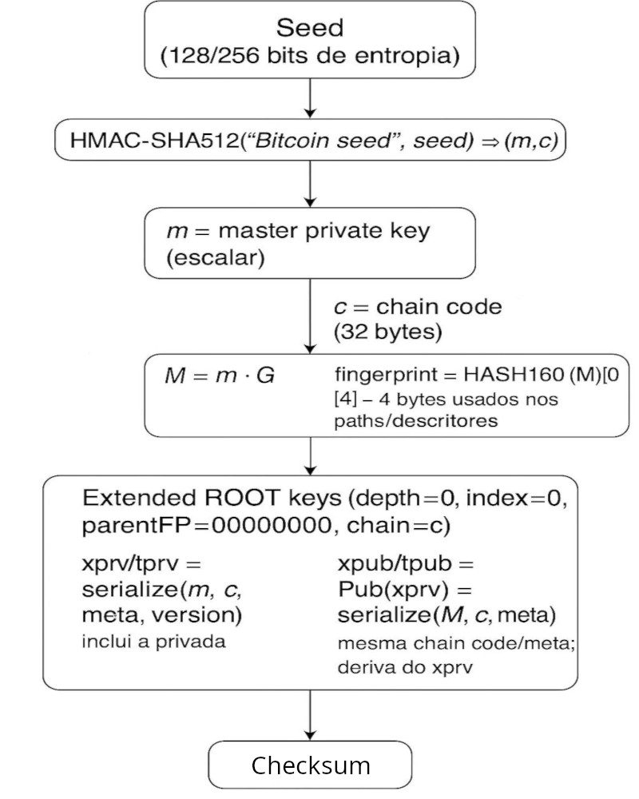

# HD Wallets e Descriptor Wallets: A Evolução da Geração de Endereços das Carteiras do Bitcoin Core

por Rafael Santos

Quando pensamos em como as carteiras são organizadas no Bitcoin Core, percebemos que houve uma grande evolução com o tempo. Nas primeiras versões, cada novo endereço era gerado de forma independente e armazenado diretamente no arquivo `wallet.dat`, sem nenhuma relação hierárquica entre eles. Isso significava que a carteira precisava guardar individualmente cada chave privada, o que dificultava backups e a recuperação em caso de perda.

Essa limitação foi superada com o surgimento das **Hierarchical Deterministic Wallets (HD Wallets)**, introduzidas pelo BIP32. Nesse modelo, em vez de gerar chaves privadas independentes, a carteira passa a gerar todas as chaves a partir de uma única chave-mestra derivada de uma seed aleatória. Essa organização hierárquica permite que, a partir de um único ponto de origem, seja possível derivar infinitos endereços de forma padronizada. Isso trouxe duas vantagens principais: os **backups se tornaram muito mais simples**, já que bastava guardar a seed ou a chave-mestra, e os **endereços passaram a ser organizados em árvores de derivação**, possibilitando separar contas, moedas e tipos de endereços.
Complementando o conceito das HD Wallets introduzido pela BIP32, a BIP44 apresentou uma definição formal dos caminhos de derivação de endereços. A partir dela, passou a existir um padrão para gerar diferentes endereços de forma organizada a partir de uma única chave-mestra.
**Formalmente**, o caminho de derivação dos endereços é descrito como:

`m / purpose' / coin_type' / account' / change / address_index`, onde

**m**

- master private key (raiz, derivada da seed).

**purpose’**

- 44’ → Legacy (P2PKH)
- 49’ → P2SH-SegWit
- 84’ → Native SegWit (Bech32)
- 86’ → Taproot

**coin_type’**

- 0’ → Bitcoin Mainnet
- 1’ → Bitcoin Testnet/Signet/Regtest

**account’**

- Usado para dividir contas lógicas (normalmente 0’). É uma maneira de colocar uma semântica na organização das contas. Por exemplo, minha carteira poderia ter uma  conta para minha empresa A, outra para minha empresa B e outra para minha pessoa física.

**change**

- 0 → endereços externos (recebimento)
- 1 → endereços internos (troco)

**address_index**

- O índice incremental (0, 1, 2, …) que gera cada endereço.

O **`'` (apóstrofo)** indica que a derivação é do tipo *hardened* (fortalecida). Isso significa que o próximo nível da árvore só pode ser derivado a partir da chave privada, impedindo que alguém com acesso apenas ao xpub (chave pública estendida) consiga chegar a essas chaves filhas. Essa característica é usada nos três primeiros níveis do caminho (purpose’, coin_type’ e account’), garantindo a segurança da estrutura principal da carteira.
Por exemplo, para gerar endereços SegWit nativos (Bech32) na signet, o caminho completo de derivação poderia ser:

```bash
m/84'/1'/0'/0/0   → primeiro endereço externo (recebimento)
m/84'/1'/0'/1/0   → primeiro endereço interno (troco)
```

## Descriptor Wallets

No Bitcoin Core moderno, essas informações aparecem descritas em **descritores de carteira**, que formalizam a maneira como os endereços são derivados a partir da chave-mestra, incluindo o tipo de script (P2PKH, P2WPKH, Taproot, etc.), os caminhos e até os checksums de validação.

Em outras palavras, os descritores são a forma como o Bitcoin Core representa e armazena os **dados de derivação**, transformando aquela estrutura teórica de árvore (BIP32/BIP44) em algo concreto e verificável dentro da carteira. É a partir deles que o Core consegue, de forma padronizada, **gerar novos endereços sempre que necessário**, mantendo consistência e segurança.

Temos a definição formal de um descritor:

```xml
<descriptor> = <script_function>([<fingerprint>/<derivation_path>]<key_expression>/<branch>/*)<checksum>
```

Onde:

- **`<script_function>`**
    
    Define o tipo de script/endereço:
    
    - `pkh()` → P2PKH (Legacy)
    - `sh(wpkh())` → P2SH-SegWit (compatibilidade)
    - `wpkh()` → P2WPKH (Native SegWit, Bech32)
    - `tr()` → P2TR (Taproot, Bech32m)
    - `wsh(sortedmulti(...))` → Multisig SegWit
- **`<fingerprint>`**
    
    4 bytes hex do hash160 da master pubkey (identifica a chave-mestra de origem).
    
- **`<derivation_path>`**
    
    Caminho no formato BIP32/BIP44: `purpose'/coin_type'/account'`.
    
- **`<key_expression>`**
    
    Pode ser:
    
    - uma extended key (`xpub`, `xprv`, `tpub`, `tprv` etc.),
    - ou uma chave pública/privada individual.
- **`<branch>`**
    
    Indica externo (`0`) ou interno/troco (`1`).
    
- *
    
    Para a faixa de derivação de índices (ex.: 0..999).
    
- **`<checksum>`**
    
    8 caracteres gerados por `getdescriptorinfo`, garantem a integridade do descritor.
    

Olhando para um exemplo:

**wpkh**([**F23ABCD1/84h/1h/0h**]**xpub6CUGRU...xyz/0/***)**#r0t3u4**

Onde os componentes são:

- **Função de script** – define o tipo de endereço/script
    - wpkh() → Native SegWit (P2WPKH, Bech32 “bc1q…” / “tb1q…” / “sb1q…”)
- **Origem da chave** [fingerprint/path] (opcional mas recomendado)
    - F23ABCD1 é o *fingerprint* (4 bytes) da chave mestre.
    - O caminho 84h/1h/0h (exemplo BIP84) deixa claro **qual conta** está sendo usada.
    - **Moeda**: **1h testnet/signet**.
    - Conta: 0h
- **Expressão da chave** (xpub/xprv, tpub/vpub em testnets)
    - O **xpub6CUGRU...xyz** é a raiz da família de endereços. Somente quando combinado com a derivação final (/0/* ou /1/*), ele gera endereços concretos.
- **Derivação final (externo, índice variável) /0/*** – o * é o índice; a carteira ativa um **range** (ex.: [0,999]).
    - /0/* → bc1q... (endereços externos/recebimento)
    - O * é o **índice variável**, que será substituído por 0, 1, 2… conforme você pede endereços novos (getnewaddress).
- **Checksum** – sufixo **#r0t3u4**
    - Quase todos os RPCs exigem o checksum.

O `h` no descritor é o correspondente ao **`'` (apóstrofo)** no caminho de derivação, ou seja, indica que é do tipo *hardened*.

Para compreender melhor como os descritores funcionam na prática, é importante voltar um passo e entender **como as chaves são derivadas a partir da seed** que dá origem a uma carteira. A seguir, veremos o processo que conecta a seed inicial até as *extended keys* (xprv/xpub), passando pela chave-mestra, a chave pública correspondente e o fingerprint.



Conforme a imagem mostra, o processo é o seguinte:

- **Seed (128/256 bits de entropia)**
    - A carteira começa com a geração de uma **seed aleatória**.
    - Essa seed é apenas um número aleatório usado como ponto de partida.
- **HMAC-SHA512("Bitcoin seed", seed) → (m, c)**
    - A seed é processada com o algoritmo HMAC-SHA512, usando a string `"Bitcoin seed"` como chave.
    - O resultado é dividido em duas partes:
        - **m** = Master Private Key (um número escalar usado como chave privada-mestra).
        - **c** = Chain Code (32 bytes que dão entropia extra para a árvore de derivação).
- **Master Public Key (M)**
    - A partir da chave privada-mestra **m**, calcula-se a chave pública-mestra **M** multiplicando o escalar `m` pelo gerador da curva elíptica secp256k1 (M = m·G).
- **Fingerprint**
    - Da master public key **M**, calcula-se o HASH160 (SHA256 + RIPEMD160).
    - Os **4 primeiros bytes** desse hash formam o **fingerprint**, usado nos descritores para identificar a origem daquela chave.
- **Extended Root Keys**
    - Combinando a **chave privada (m)**, o **chain code (c)** e metadados (profundidade, índice, fingerprint do pai, versão de rede), são formadas as **extended keys de raiz**.
    - Elas são do tipo **depth=0, index=0, parentFP=00000000** (por estarem na raiz).
- **xprv / tprv** (Extended Private Key)
    - É a serialização da chave privada **m** junto com o chain code e os metadados.
    - Em mainnet usa prefixo `xprv`, em testnet/signet `tprv`.
    - Contém material privado, ou seja, permite gastar fundos.
- **xpub / tpub** (Extended Public Key)
    - Derivado diretamente do **xprv**, trocando a chave privada pela chave pública **M**.
    - Usa o mesmo chain code e metadados.
    - Em mainnet começa com `xpub`, em testnet/signet `tpub`.
    - É seguro compartilhar: só gera endereços, sem poder gastar.

Podemos ver agora na prática no Bitcoin Core!

Criamos uma carteira:

```bash
bitcoin-cli -datadir="." createwallet "MinhaCarteira"
```

Logo após a criação, essa carteira já possui um conjunto de **descritores ativos**. Para listá-los, usamos:

```bash
bitcoin-cli -datadir="." -rpcwallet=MinhaCarteira listdescriptors
```

E temos como saída:

```bash
{
  "wallet_name": "MinhaCarteira",
  "descriptors": [
    {
      "desc": "pkh([44026f8b/44h/1h/0h]tpubDDWFDcF3TZLSxKJFenAL3c1aVAF441AfZthX7F3E9fqtGw3FpMMpUJrYQ5P4TTQPvRj2aWtueV5SH7ZXoNRN6s2z2manaQRs5ysUjAK6WM6/0/*)#j8lxna7j",
      "timestamp": 1755864669,
      "active": true,
      "internal": false,
      "range": [
        0,
        999
      ],
      "next": 0,
      "next_index": 0
    },
    {
      "desc": "pkh([44026f8b/44h/1h/0h]tpubDDWFDcF3TZLSxKJFenAL3c1aVAF441AfZthX7F3E9fqtGw3FpMMpUJrYQ5P4TTQPvRj2aWtueV5SH7ZXoNRN6s2z2manaQRs5ysUjAK6WM6/1/*)#rn68wgw2",
      "timestamp": 1755864669,
      "active": true,
      "internal": true,
      "range": [
        0,
        999
      ],
      "next": 0,
      "next_index": 0
    },
    {
      "desc": "sh(wpkh([44026f8b/49h/1h/0h]tpubDDCTFFtooJWfiS2sZp8kSAno8YjSBVZZZUKq6nTkLeAhc1qTTW1jQzrJWqEAQDjrXUL9TVia6oX7yrQkdetWwVHghmMm4tgkNbeW6v3SVoh/0/*))#n66qdd6h",
      "timestamp": 1755864669,
      "active": true,
      "internal": false,
      "range": [
        0,
        999
      ],
      "next": 0,
      "next_index": 0
    },
    {
      "desc": "sh(wpkh([44026f8b/49h/1h/0h]tpubDDCTFFtooJWfiS2sZp8kSAno8YjSBVZZZUKq6nTkLeAhc1qTTW1jQzrJWqEAQDjrXUL9TVia6oX7yrQkdetWwVHghmMm4tgkNbeW6v3SVoh/1/*))#xm5k4j0g",
      "timestamp": 1755864669,
      "active": true,
      "internal": true,
      "range": [
        0,
        999
      ],
      "next": 0,
      "next_index": 0
    },
    {
      "desc": "tr([44026f8b/86h/1h/0h]tpubDDDZqVE9qnFZxS8jBR6pnEuwFEnnomPU8B7vDGLD3H3fXtkAtXwpkkddoTf38Ltz7TPuZbGtx1YMAEEacnx6Yt4ib8hrveN1iSjXZH77pFh/0/*)#3h0axe97",
      "timestamp": 1755864669,
      "active": true,
      "internal": false,
      "range": [
        0,
        999
      ],
      "next": 0,
      "next_index": 0
    },
    {
      "desc": "tr([44026f8b/86h/1h/0h]tpubDDDZqVE9qnFZxS8jBR6pnEuwFEnnomPU8B7vDGLD3H3fXtkAtXwpkkddoTf38Ltz7TPuZbGtx1YMAEEacnx6Yt4ib8hrveN1iSjXZH77pFh/1/*)#qr2umv4x",
      "timestamp": 1755864669,
      "active": true,
      "internal": true,
      "range": [
        0,
        999
      ],
      "next": 0,
      "next_index": 0
    },
    {
      "desc": "wpkh([44026f8b/84h/1h/0h]tpubDCd8PW7rDNVWeYt1LRFG5EdkGC1DQuBHhT4HBhPx42nc3uueBYwujHxAtDQtpvFAx2bbCGKiNBVs1WBn4d9Y1udR8HEGGSznfaUrwGYbkEe/0/*)#my5eel6x",
      "timestamp": 1755864669,
      "active": true,
      "internal": false,
      "range": [
        0,
        999
      ],
      "next": 0,
      "next_index": 0
    },
    {
      "desc": "wpkh([44026f8b/84h/1h/0h]tpubDCd8PW7rDNVWeYt1LRFG5EdkGC1DQuBHhT4HBhPx42nc3uueBYwujHxAtDQtpvFAx2bbCGKiNBVs1WBn4d9Y1udR8HEGGSznfaUrwGYbkEe/1/*)#2s3cy227",
      "timestamp": 1755864669,
      "active": true,
      "internal": true,
      "range": [
        0,
        999
      ],
      "next": 0,
      "next_index": 0
    }
  ]
}
```

O resultado mostra que o Bitcoin Core cria automaticamente **8 descritores**:

- 2 para **Legacy (BIP44)** — externo e interno (troco).
- 2 para **P2SH-SegWit (BIP49)** — externo e interno.
- 2 para **Bech32 nativo (BIP84)** — externo e interno.
- 2 para **Taproot (BIP86)** — externo e interno.

Ou seja, cada tipo de endereço moderno vem acompanhado dos seus dois ramos de derivação (recebimento e troco).

Como exemplo, vejamos um dos descritores criados automaticamente:

```bash
{
  "desc": "sh(wpkh([44026f8b/49h/1h/0h]tpubDDCTFFtooJWfiS2sZp8kSAno8YjSBVZZZUKq6nTkLeAhc1qTTW1jQzrJWqEAQDjrXUL9TVia6oX7yrQkdetWwVHghmMm4tgkNbeW6v3SVoh/0/*))#n66qdd6h",
  "timestamp": 1755864669,
  "active": true,
  "internal": false,
  "range": [0, 999],
  "next": 0,
  "next_index": 0
}
```

Esse descritor pode ser entendido em partes:

1. **`sh(wpkh(...))`**
    - Indica que este ramo é do tipo **P2SH-SegWit (BIP49)**.
    - Na prática, gera endereços `3...` na mainnet ou `2...` na testnet.
2. **`[44026f8b/49h/1h/0h]`**
    - O `44026f8b` é o **fingerprint** da chave-mestra da carteira.
    - O caminho `/49h/1h/0h` segue o padrão BIP49:
        - `49h` → propósito (P2SH-SegWit).
        - `1h` → coin type (testnet/signet).
        - `0h` → conta 0.
3. **`tpubDDCTF...SVoh`**
    - É a **extended public key (tpub)** da conta `m/49'/1'/0'`.
    - A partir dela o Core consegue derivar todos os endereços filhos desse ramo.
4. **`/0/*`**
    - Indica o **branch externo** (`0` = endereços de recebimento).
    - O  representa o índice incremental (`0,1,2...`).
5. **`#n66qdd6h`**
    - É o **checksum** do descritor, usado para validar sua integridade.
6. **Metadados adicionais**
    - `"internal": false` → este ramo é externo (recebimento).
    - `"range": [0,999]` → permite derivar até mil endereços automaticamente.
    - `"next_index": 0` → o próximo endereço a ser usado será o índice 0.

Assim, em uma única linha o descritor encapsula **qual tipo de endereço gerar, de onde vem a chave, qual o caminho de derivação, qual o ramo (externo/interno) e até um mecanismo de verificação**.

Perceba que os oito descritores exibidos até aqui aparecem no formato **tpub**, ou seja, representam apenas as **extended public keys** da carteira. Isso acontece porque, por padrão, o comando `listdescriptors` retorna apenas a versão pública dos descritores, suficiente para derivar endereços mas incapaz de gastar fundos. Caso queiramos visualizar também os **descritores privados** (no formato `tprv`), basta executar o comando com o parâmetro adicional `true` no final:

```bash
bitcoin-cli -datadir="." -rpcwallet=MinhaCarteira listdescriptors true
```

Assim, teremos acesso às chaves privadas estendidas, que são as responsáveis por possibilitar a assinatura e o gasto dos bitcoins associados à carteira.

Na prática, todo esse conjunto de descritores é o que permite que o Bitcoin Core gere novos endereços sob demanda. Quando executamos, por exemplo:

```bash
bitcoin-cli -datadir="." -rpcwallet=MinhaCarteira getnewaddress
```

O Core não cria um descritor novo. Ele simplesmente consulta o descritor **externo ativo** (por padrão, SegWit nativo Bech32, `wpkh(...)`), verifica o próximo índice disponível (`next_index`) dentro do intervalo configurado e deriva o endereço correspondente. Dessa forma, o comando `getnewaddress` nada mais é do que a aplicação direta da árvore de derivação descrita nos descritores da carteira.

Ao executar o comando acima, o Core retornou:

```bash
tb1qznwx8w3sy646kajznvu39ulaf32shury3kgm26
```

Esse endereço **não surgiu do nada**, ele foi derivado diretamente de um dos descritores ativos da carteira. No caso, trata-se de um endereço **Bech32 SegWit nativo (BIP84)**, correspondente ao descritor:

```bash
wpkh([fingerprint/84h/1h/0h]tpub.../0/*)#checksum
```

O Core apenas pegou o índice `0`do ramo externo `(/0/*)` desse descritor, aplicou a função de derivação, e gerou o endereço `tb1qznwx...`. Se rodarmos o comando novamente, o próximo endereço `(tb1q...)` virá do mesmo descritor, mas já no índice `1`, e assim sucessivamente.

---

Em resumo, as HD Wallets trouxeram a base determinística para a geração estruturada de endereços, enquanto os descritores refinaram esse processo ao fornecer uma forma padronizada, explícita e auditável de organizar as carteiras no Bitcoin Core. Hoje, cada novo endereço gerado pelo comando `getnewaddress` carrega por trás de si toda essa lógica de seeds, chaves estendidas, fingerprints e descritores. Entender esse fluxo é fundamental para compreender não apenas como o Core administra os endereços, mas também como o Bitcoin evoluiu para oferecer carteiras mais seguras, interoperáveis e confiáveis.

---
