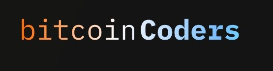

# 🧠 Bitcoin Coders

> Aprenda, construa e contribua para o ecossistema Bitcoin — da base ao código.

---

## 🌍 Sobre

O **Bitcoin Coders** é uma iniciativa educacional aberta dedicada à formação de desenvolvedores Bitcoin com **foco técnico, prático e profundo**.

Aqui o aluno aprende **como o Bitcoin realmente funciona**, operando nodes, explorando o Bitcoin Core, entendendo transações, scripts, assinaturas e, por fim, construindo aplicações e contribuindo com o ecossistema open source.

Nosso lema resume a filosofia do projeto:

**Build. Verify. Contribute.**

---

## 🧭 Organização do Repositório

Este repositório é organizado em **Cursos** e **Programas**.

* **[Artigos](./Artigos)** → Artigos técnicos, focado em subsistemas específicos do Bitcoin.
* **[Cursos](./Cursos)** → Conteúdo técnico contínuo e modular, focado em subsistemas específicos do Bitcoin.
* **[Programas](./Programas)** → Imersões práticas de curta duração, integrando múltiplos cursos em projetos reais.

---

## 📚 [Cursos](./Cursos)

### 🧩 [Curso 1: Dominando as Carteiras no Bitcoin Core](https://github.com/Bitcoin-Coders/bitcoin-coders/blob/main/Cursos/README.md#-curso-1--dominando-as-carteiras-no-bitcoin-core)

**Descrição:**
Aprenda como o Bitcoin Core gerencia chaves, endereços e UTXOs na prática. Do `wallet.dat` às **Descriptor Wallets**, você entende como o node cria endereços, organiza fundos e expõe tudo via RPC e bitcoin-cli.

**Tópicos centrais:**

* Wallets no Bitcoin Core
* HD Wallets e descriptors
* Tipos de endereços (Legacy, SegWit, Taproot)
* Comandos como `getnewaddress`, `listunspent`, `listdescriptors`

---

### ⚡ [Curso 2: Transações no Bitcoin Core e Signet](https://github.com/Bitcoin-Coders/bitcoin-coders/blob/main/Cursos/README.md#-curso-2--transa%C3%A7%C3%B5es-no-bitcoin-core-e-signet)

**Descrição:**
Construa, analise e envie transações diretamente pelo bitcoin-cli, entendendo mempool, taxas e políticas do node. O curso usa **Signet** para experimentação realista, sem risco financeiro.

**Tópicos centrais:**

* Transações brutas
* Fees, mempool e políticas
* RBF e CPFP
* PSBT, multisig e timelocks
* Uso prático de Signet

---

### 🧠 [Curso 3: Scripts — Como o Bitcoin Executa Suas Regras](https://github.com/Bitcoin-Coders/bitcoin-coders/blob/main/Cursos/README.md#-curso-3--scripts-como-o-bitcoin-executa-suas-regras)

**Descrição:**
Vá além dos endereços e entenda como o Bitcoin valida gastos usando **Bitcoin Script**. Você aprende como as regras são executadas na máquina de pilha e como scripts viram endereços na prática.

**Tópicos centrais:**

* `scriptPubKey` vs `scriptSig`
* Máquina de pilha e fluxo de execução
* Opcodes essenciais (OP_CHECKSIG, OP_IF, OP_CHECKMULTISIG, OP_CLTV)
* Scripts condicionais, multisig e timelocks
* Uso de `decodescript` e bitcoin-cli

---

### 🔐 [Curso 4: Assinaturas Digitais no Bitcoin](https://github.com/Bitcoin-Coders/bitcoin-coders/blob/main/Cursos/README.md#-curso-4--assinaturas-digitais-no-bitcoin)

**Descrição:**
Entenda como o Bitcoin prova a autorização de um gasto. Do **ECDSA** ao **Schnorr**, você aprende como as assinaturas aparecem nas transações e como o protocolo evita maleabilidade.

**Tópicos centrais:**

* Assinaturas ECDSA (r, s)
* DER, low-S e maleabilidade
* SIGHASH e seus impactos
* Assinaturas Schnorr e Taproot
* Witness e indistinguibilidade de transações

---

### ⛓️ [Curso 5: Núcleo do Bitcoin — Blocos, Mineração, Propagação e Validação](https://github.com/Bitcoin-Coders/bitcoin-coders/blob/main/Cursos/README.md#%EF%B8%8F-curso-5--n%C3%BAcleo-do-bitcoin-blocos-minera%C3%A7%C3%A3o-propaga%C3%A7%C3%A3o-e-valida%C3%A7%C3%A3o)

**Descrição:**  
Entenda o funcionamento interno do Bitcoin a partir do ponto de vista do node.  
Neste curso, você mergulha no ciclo completo de vida de um bloco: da construção pelo minerador à validação local pelo node, passando pela propagação na rede P2P, regras de consenso, chainstate e políticas que determinam o que é aceito e retransmitido. Tudo explorado na prática com Bitcoin Core e bitcoin-cli.

**Tópicos centrais:**

- Estrutura completa de blocos (header, transações e coinbase)
- Proof of Work, target, difficulty e ajuste de dificuldade
- Mineração na prática (regtest)
- Propagação de blocos e transações na rede P2P
- Validação de blocos, chainstate e UTXO set
- Reorganizações de chain (reorgs) e forks
- Políticas de validação vs regras de consenso
- Inspeção e diagnóstico via bitcoin-cli

---

## 🧪 [Programas](./Programas)

### ⚙️ [CoreCraft — Domine o Bitcoin Core na Prática](https://bitcoincoders.org/#programas)

**Início:** em breve

[**Link para se inscrever**](https://bitcoincoders.org/#programas)

**Descrição:**
Uma imersão prática para dominar o Bitcoin Core de ponta a ponta, da linha de comando à integração via RPC, culminando na construção de uma aplicação que interage diretamente com um node Bitcoin.

**Formato:**

* Duração: **3 semanas**
* Teoria + projetos práticos
* 100% online e gratuito
* Aulas gravadas
* Mentorias ao vivo
* Hackathon final

---

> 🔜 Mais programas especializados estão em desenvolvimento.

---

## 🤝 Apoio

O **Bitcoin Coders** é uma iniciativa educacional aberta **apoiada pela [Area Bitcoin](https://areabitcoin.com.br)**.

O objetivo é fortalecer a formação técnica de desenvolvedores e contribuir para um ecossistema Bitcoin mais sólido, auditável e descentralizado.

---

## 💡 Filosofia

> “Entender o Bitcoin é mais do que aprender sobre dinheiro —
> é compreender como sistemas podem funcionar sem permissões.”

---

## 📬 Contato

🌐 [https://bitcoincoders.org](https://bitcoincoders.org)
✉️ [hello@bitcoincoders.org](mailto:hello@bitcoincoders.org)
🇧🇷 Brasil

---

© 2025 Bitcoin Coders — código aberto, aprendizado livre.
