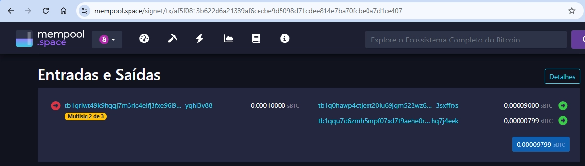

# Transferências Avançadas e Segurança

Nos três artigos anteriores da série **Transferências no Bitcoin**, exploramos desde a anatomia básica de uma transação até estratégias mais eficientes de envio, sempre com ênfase prática no uso do Bitcoin Core em redes de teste. Agora, avançamos: além de movimentar bitcoins de forma correta e econômica, é hora de pensar em **como fortalecer a segurança de cada transferência**.

Esse passo é essencial porque, no ecossistema Bitcoin, a proteção não depende apenas de guardar bem a chave privada. O conceito de defesa em camadas mostra que a segurança verdadeira surge quando criamos várias barreiras: desde a geração das chaves até a própria forma como estruturamos as transações. Recursos como **multisig** e **timelocks** permitem criar operações que resistem a perdas, roubos ou acessos não autorizados, oferecendo resiliência mesmo em cenários de falha.

Neste artigo, vamos ver como aplicar cada uma dessas técnicas, combinando teoria e prática para que suas transferências não apenas aconteçam, mas sejam mais robustas e versáteis. Antes, vamos entender as **PSBT (Partially Signed Bitcoin Transaction)**, que são fundamentais para utilização desses recursos avançados.

---

### PSBT – Transações Parcialmente Assinadas

A **PSBT** é um padrão definido na [BIP174](https://github.com/bitcoin/bips/blob/master/bip-0174.mediawiki) que permite criar, compartilhar e assinar transações de forma colaborativa.

Ela separa nitidamente as etapas:

1. **Criação da transação bruta:** quem seleciona UTXOs e define os destinos.
2. **Assinatura:** cada participante assina apenas sua parte, em seu próprio dispositivo.
3. **Finalização/Broadcast:** montagem final e envio à rede.

Isso garante que **nenhum dispositivo precisa de todas as chaves** nem de acesso total à internet, o que é essencial para **multisig**, **hardware wallets** ou **setups air-gapped**.

**Comandos básicos no Bitcoin Core:**

| Etapa | Comando |
| --- | --- |
| Criar PSBT com inputs/outputs definidos | `walletcreatefundedpsbt` |
| Assinar parcialmente | `walletprocesspsbt` |
| Combinar várias PSBTs (vários signatários) | `combinepsbt` |
| Finalizar (gera hex transmitível) | `finalizepsbt` |
| Enviar | `sendrawtransaction` |

**PSBT é útil mesmo com 1 assinante** quando você separa ambientes: cria a transação em uma máquina e assina em outra (segura/offline).

Vamos a um exemplo no Bitcoin Core.

**0) Pré-requisitos**

- Você já tem uma carteira com saldo em signet.

**1) Criar a PSBT (seleciona UTXOs e define saídas)**

```bash
bitcoin-cli -datadir="." walletcreatefundedpsbt \
  '[]' '[{"tb1q2tygw0rd24cgrrj9dajqrh398clxucnhdwlxew":0.0001}]' \
  0 '{"subtractFeeFromOutputs":[0]}' true
{
  "psbt": "cHNidP8BAHECAAAAAXT7uaRFVyzfv8vbDqsOc4AWZzxAoX0SgXzlK63dkuV+AAAAAAD9////Ao4hAAAAAAAAFgAUUsiHPG1VcIGORW9kAd4lPj5uYnf+WQEAAAAAABYAFO7wQWnkgYcWv54ru1f5kZA+PWOTAAAAAAABAHECAAAAAS0mLffRUqI69eSsvc7Kr1Gcvn0FbSfYGqHxIdrYytV9AAAAAAD9////Ag6BAQAAAAAAFgAULfNI+6HV8XwNm6k215opak1NIUOEAwAAAAAAABYAFFWyh7v5Wliw/eMsyvIhdIjcFcOWAAAAAAEBHw6BAQAAAAAAFgAULfNI+6HV8XwNm6k215opak1NIUMiBgMtyDX9uzN8sBoE/EgnwKqA1165uji362cmhOoaNApSshh3Rt53VAAAgAEAAIAAAACAAQAAAAQAAAAAIgID3LDPfRo5Dnqny9PwT9gVhlm4NpBIJxhHkpOqHJuWGA8Yd0bed1QAAIABAACAAAAAgAAAAAAHAAAAACICAibyHkvhAx+N5YcfQp9R5xJa97neDE4nHzBDceWY5iIsGHdG3ndUAACAAQAAgAAAAIABAAAABQAAAAA=",
  "fee": 0.00001410,
  "changepos": 1
}
```

**2) Assinar parcialmente (na mesma carteira)**

```bash
bitcoin-cli -datadir="." walletprocesspsbt "cHNidP8BAHECAAAAAXT7uaRFVyzfv8vbDqsOc4AWZzxAoX0SgXzlK63dkuV+AAAAAAD9////Av5ZAQAAAAAAFgAUPB1NRWTdgyzRoZFlsIIWnyBXUe6OIQAAAAAAABYAFFLIhzxtVXCBjkVvZAHeJT4+bmJ3AAAAAAABAHECAAAAAS0mLffRUqI69eSsvc7Kr1Gcvn0FbSfYGqHxIdrYytV9AAAAAAD9////Ag6BAQAAAAAAFgAULfNI+6HV8XwNm6k215opak1NIUOEAwAAAAAAABYAFFWyh7v5Wliw/eMsyvIhdIjcFcOWAAAAAAEBHw6BAQAAAAAAFgAULfNI+6HV8XwNm6k215opak1NIUMiBgMtyDX9uzN8sBoE/EgnwKqA1165uji362cmhOoaNApSshh3Rt53VAAAgAEAAIAAAACAAQAAAAQAAAAAIgICzhcJSGl7Ti2W88hb5YQcmaXesjGIVfnwQfI9ua9/YugYd0bed1QAAIABAACAAAAAgAEAAAAGAAAAACICA9ywz30aOQ56p8vT8E/YFYZZuDaQSCcYR5KTqhyblhgPGHdG3ndUAACAAQAAgAAAAIAAAAAABwAAAAA="
{
  "psbt": "cHNidP8BAHECAAAAAXT7uaRFVyzfv8vbDqsOc4AWZzxAoX0SgXzlK63dkuV+AAAAAAD9////Av5ZAQAAAAAAFgAUPB1NRWTdgyzRoZFlsIIWnyBXUe6OIQAAAAAAABYAFFLIhzxtVXCBjkVvZAHeJT4+bmJ3AAAAAAABAHECAAAAAS0mLffRUqI69eSsvc7Kr1Gcvn0FbSfYGqHxIdrYytV9AAAAAAD9////Ag6BAQAAAAAAFgAULfNI+6HV8XwNm6k215opak1NIUOEAwAAAAAAABYAFFWyh7v5Wliw/eMsyvIhdIjcFcOWAAAAAAEBHw6BAQAAAAAAFgAULfNI+6HV8XwNm6k215opak1NIUMBCGsCRzBEAiAr3JNj8Wi53EJXvNDkCsKxxJsMImD936VKE6qyh5aJCwIgMcro3u7lcRSAF7PQrOBZVSv2eTPY9n/yJke8FqcMbxgBIQMtyDX9uzN8sBoE/EgnwKqA1165uji362cmhOoaNApSsgAiAgLOFwlIaXtOLZbzyFvlhByZpd6yMYhV+fBB8j25r39i6Bh3Rt53VAAAgAEAAIAAAACAAQAAAAYAAAAAIgID3LDPfRo5Dnqny9PwT9gVhlm4NpBIJxhHkpOqHJuWGA8Yd0bed1QAAIABAACAAAAAgAAAAAAHAAAAAA==",
  "complete": true,
  "hex": "0200000000010174fbb9a445572cdfbfcbdb0eab0e738016673c40a17d12817ce52baddd92e57e0000000000fdffffff02fe590100000000001600143c1d4d4564dd832cd1a19165b082169f205751ee8e2100000000000016001452c8873c6d5570818e456f6401de253e3e6e62770247304402202bdc9363f168b9dc4257bcd0e40ac2b1c49b0c2260fddfa54a13aab28796890b022031cae8deeee571148017b3d0ace059552bf67933d8f67ff22647bc16a70c6f180121032dc835fdbb337cb01a04fc4827c0aa80d75eb9ba38b7eb672684ea1a340a52b200000000"
}
```

`walletprocesspsbt` adiciona as assinaturas que a carteira consegue fazer. Em uma carteira comum (não multisig), isso deixa `complete=true`.

Explicando os campos que o comando retorna:

**`psbt`**

- É a **transação parcialmente assinada** (ainda em *formato PSBT*, base64).
- Serve se você **ainda fosse passar para outro signatário** ou quisesse guardar o arquivo.
- Caso `complete` fosse `false`, esse seria o valor a enviar para o próximo participante ou para usar em `finalizepsbt`.

**`complete`** 

- `true` significa que *todas* as assinaturas necessárias já foram adicionadas.
- Se fosse `false`, você continuaria circulando o PSBT entre as partes ou rodaria `combinepsbt` etc.

**`hex`**

- É a **transação Bitcoin final** já serializada (raw hex) pronta para a rede.
- Quando `complete` é `true`, o Core já te entrega esse hex, que já pode ser transmitido.

**3) Finalizar e transmitir**

**Como `complete = true`**, ****não precisa chamar `finalizepsbt`. Basta pegar o valor de `hex` e transmitir:

```bash
bitcoin-cli -datadir="." sendrawtransaction "0200000000010174fbb9a445572cdfbfcbdb0eab0e738016673c40a17d12817ce52baddd92e57e0000000000fdffffff02fe590100000000001600143c1d4d4564dd832cd1a19165b082169f205751ee8e2100000000000016001452c8873c6d5570818e456f6401de253e3e6e62770247304402202bdc9363f168b9dc4257bcd0e40ac2b1c49b0c2260fddfa54a13aab28796890b022031cae8deeee571148017b3d0ace059552bf67933d8f67ff22647bc16a70c6f180121032dc835fdbb337cb01a04fc4827c0aa80d75eb9ba38b7eb672684ea1a340a52b200000000"
# a1a93c02cfb449040677950d1abf33f57c923273d5f091c942c08d229e638ce4
```

**Se `complete` = false**, ****usaríamos o `"psbt"` retornado:

```bash
bitcoin-cli -datadir="." finalizepsbt "<PSBT_ASSINADA>"
```

Esse comando geraria o hex final a ser transmitido.

### Multisig

Multisig é um esquema de custódia no Bitcoin em que um gasto só é válido quando um número mínimo pré-definido de chaves entre várias participantes assina a transação, como “2-de-3” ou “3-de-5”, aumentando a segurança e permitindo controle compartilhado.

**Vantagens:**

- **Resistência a roubo/perda:** 1 chave comprometida não gasta os fundos (em 2-de-3); perda de 1 chave ainda permite recuperação.
- **Herança/backup:** distribuição de chaves entre pessoas/cofres diferentes.
- **Governança:** políticas de aprovação (m-de-n) para empresas/DAOs.

Vamos ver um exemplo prático no Bitcoin Core:

**1) Criar três carteiras (participantes)**

```bash
bitcoin-cli -datadir="." createwallet carteira1 true true "" true true
bitcoin-cli -datadir="." createwallet carteira2 true true "" true true
bitcoin-cli -datadir="." createwallet carteira3 true true "" true true
```

Criamos carteiras **com chaves privadas** e **com descriptors**. Evite `blank=true` e `disable_private_keys=true` para não obter carteiras “vazias”.

**2) Obter os xpubs (com fingerprint/derivação)**

Para cada carteira, liste os descriptors públicos e copie as linhas de **recebimento (…/0/*)** e **troco (…/1/*)**:

```bash
bitcoin-cli -datadir="." -rpcwallet=carteira1 listdescriptors
{
  "wallet_name": "carteira1",
  "descriptors": [
    ...,
    {
      "desc": "wpkh([ba39c771/84h/1h/0h]tpubDCYmREHcMiWLvGJ4goQeYcvNARJtp8Bcuf2wSo5NZKHLHiu91xoH1135ngN3MmHHB9L6bYabHiFkBamEavcVeEoKGDWj7op1atN6xeCotwk/0/*)#jr2a4z9x",
      "timestamp": 1758650612,
      "active": true,
      "internal": false,
      "range": [
        0,
        999
      ],
      "next": 0,
      "next_index": 0
    },
    {
      "desc": "wpkh([ba39c771/84h/1h/0h]tpubDCYmREHcMiWLvGJ4goQeYcvNARJtp8Bcuf2wSo5NZKHLHiu91xoH1135ngN3MmHHB9L6bYabHiFkBamEavcVeEoKGDWj7op1atN6xeCotwk/1/*)#rh0ugh47",
      "timestamp": 1758650613,
      "active": true,
      "internal": true,
      "range": [
        0,
        999
      ],
      "next": 0,
      "next_index": 0
    }
  ]
}
```

```bash
bitcoin-cli -datadir="." -rpcwallet=carteira2 listdescriptors
{
 ...,
    {
      "desc": "wpkh([1b69360a/84h/1h/0h]tpubDD2gr2TXupxDBjtLUnFkWVsNMYNNcPeLrRmR4M9Eo7NEShdCnJRcsccxRtzAKDT1F2cXGdSKPTerBX2FsYRUcDZtRNzd7rPeS9Fg3HMBC4x/0/*)#k32vf2uu",
      "timestamp": 1758650639,
      "active": true,
      "internal": false,
      "range": [
        0,
        999
      ],
      "next": 0,
      "next_index": 0
    },
    {
      "desc": "wpkh([1b69360a/84h/1h/0h]tpubDD2gr2TXupxDBjtLUnFkWVsNMYNNcPeLrRmR4M9Eo7NEShdCnJRcsccxRtzAKDT1F2cXGdSKPTerBX2FsYRUcDZtRNzd7rPeS9Fg3HMBC4x/1/*)#890d5lvy",
      "timestamp": 1758650640,
      "active": true,
      "internal": true,
      "range": [
        0,
        999
      ],
      "next": 0,
      "next_index": 0
    }
  ]
}
```

```bash
bitcoin-cli -datadir="." -rpcwallet=carteira3 listdescriptors
{
  "wallet_name": "carteira3",
  "descriptors": [
    ...,
    {
      "desc": "wpkh([fd4d4620/84h/1h/0h]tpubDDnWDjzpV82Wxdr7woANyPdKnSvQvEERPnzxoK2iPLUf8M8HA6Dr1rKw5FqnUFabN5zbQjexYNTCW8QC16NUpd6m1JogodyjLe5fRYvQ5KT/0/*)#5szljz27",
      "timestamp": 1758650645,
      "active": true,
      "internal": false,
      "range": [
        0,
        999
      ],
      "next": 0,
      "next_index": 0
    },
    {
      "desc": "wpkh([fd4d4620/84h/1h/0h]tpubDDnWDjzpV82Wxdr7woANyPdKnSvQvEERPnzxoK2iPLUf8M8HA6Dr1rKw5FqnUFabN5zbQjexYNTCW8QC16NUpd6m1JogodyjLe5fRYvQ5KT/1/*)#9y870h6x",
      "timestamp": 1758650645,
      "active": true,
      "internal": true,
      "range": [
        0,
        999
      ],
      "next": 0,
      "next_index": 0
    }
  ]
}
```

**O que copiar:** os descriptors públicos de recebimento (…/0/*) e troco (…/1/*), eles trazem fingerprint + caminho (ex.: [ba39c771/84h/1h/0h]tpub.../0/*), que é essencial para montar o multisig corretamente.

**Padrão de endereço:** os exemplos usam a derivação 84h/1h/0h (Bech32, P2WPKH para singlesig). No multisig, vamos combiná-los em P2WSH (wsh(sortedmulti(...))).

**3) Criar carteira multisig (watch-only) e importar os descriptors multisig (recebimento e troco)**

**Por que “watch-only”?** Essa carteira **vê** UTXOs, **gera endereços** e **cria PSBTs**, mas **não** tem chaves privadas, as assinaturas acontecem nas carteiras participantes (carteira1, 2 e 3).

```bash
bitcoin-cli -datadir="." createwallet multisig-2of3 true true "" true true
{
  "name": "multisig-2of3",
  "warnings": [
    "Empty string given as passphrase, wallet will not be encrypted."
  ]
}
```

```bash
bitcoin-cli -datadir="." -rpcwallet=multisig-2of3 importdescriptors [{\"desc\":\"wsh(sortedmulti(2,[ba39c771/84h/1h/0h]tpubDCYmREHcMiWLvGJ4goQeYcvNARJtp8Bcuf2wSo5NZKHLHiu91xoH1135ngN3MmHHB9L6bYabHiFkBamEavcVeEoKGDWj7op1atN6xeCotwk/0/*,[1b69360a/84h/1h/0h]tpubDD2gr2TXupxDBjtLUnFkWVsNMYNNcPeLrRmR4M9Eo7NEShdCnJRcsccxRtzAKDT1F2cXGdSKPTerBX2FsYRUcDZtRNzd7rPeS9Fg3HMBC4x/0/*,[fd4d4620/84h/1h/0h]tpubDDnWDjzpV82Wxdr7woANyPdKnSvQvEERPnzxoK2iPLUf8M8HA6Dr1rKw5FqnUFabN5zbQjexYNTCW8QC16NUpd6m1JogodyjLe5fRYvQ5KT/0/*))#ed8gy0hl\",\"active\":true,\"timestamp\":\"now\"},{\"desc\":\"wsh(sortedmulti(2,[ba39c771/84h/1h/0h]tpubDCYmREHcMiWLvGJ4goQeYcvNARJtp8Bcuf2wSo5NZKHLHiu91xoH1135ngN3MmHHB9L6bYabHiFkBamEavcVeEoKGDWj7op1atN6xeCotwk/1/*,[1b69360a/84h/1h/0h]tpubDD2gr2TXupxDBjtLUnFkWVsNMYNNcPeLrRmR4M9Eo7NEShdCnJRcsccxRtzAKDT1F2cXGdSKPTerBX2FsYRUcDZtRNzd7rPeS9Fg3HMBC4x/1/*,[fd4d4620/84h/1h/0h]tpubDDnWDjzpV82Wxdr7woANyPdKnSvQvEERPnzxoK2iPLUf8M8HA6Dr1rKw5FqnUFabN5zbQjexYNTCW8QC16NUpd6m1JogodyjLe5fRYvQ5KT/1/*))#tcmu8qku\",\"active\":true,\"internal\":true,\"timestamp\":\"now\"}]
[
  {
    "success": true,
    "warnings": [
      "Range not given, using default keypool range"
    ]
  },
  {
    "success": true,
    "warnings": [
      "Range not given, using default keypool range"
    ]
  }
]
```

**`sortedmulti`**: garante uma ordem determinística das chaves (independente da ordem de entrada), evitando endereços diferentes para o mesmo conjunto de chaves.
O aviso **“Range not given”** apenas informa que o Core usará o **range padrão 0–999** para geração dos endereços. Para a maioria dos casos, está ótimo.

**4) Receber fundos na multisig**

Gere um novo endereço para essa nova carteira multisig:

```bash
bitcoin-cli -datadir="." -rpcwallet=multisig-2of3 getnewaddress
# tb1qrlwt49k9hqgj7m3rlc4elfj3fxe96l93zz9ez5209z8uskrqg7yqhl3v88
```

Envie alguns sats para o endereço gerado (via faucet de signet). Aguarde 1+ confirmações.

**5) Criar a PSBT de gasto (na multisig)**

```bash
bitcoin-cli -datadir="." -rpcwallet=multisig-2of3 walletcreatefundedpsbt "[]" "[{\"tb1qqu7d6zmh5mpf07xd7t9aehe0re63hfqk2wh2ew6045zc5svshphq7j4eek\":0.00001}]" 0 "{\"subtractFeeFromOutputs\":[0]}" true
{
  "psbt": "cHNidP8BAIkCAAAAAbALDAmCzaLpmGLM3HosXOuodp03BnzZOWlsWzDBGdb6AQAAAAD9////AigjAAAAAAAAIgAgffrg1wuWTLU//NFkDdFKcLTiMQqIGXRBJYuZFOVjxmMfAwAAAAAAACIAIAc83Qt3psKX+M3yy9zfLx51G6QWU66su0+tBYpBkLhuAAAAAAABAIkCAAAAAVAByKT0ARhfFgU643lMMBY/UOnTo7PBxfKqTH7IFf1ZAAAAAAD9////An0DOwAAAAAAIlEgEOILQOfM8jum+vwMWifdS7i6Aexaov0TSmGb2+hRcQsQJwAAAAAAACIAIB/cupbFuBEvbiP+K5+mUUmyXXyxEIuRUU8oj8hYYEeIQiIEAAEBKxAnAAAAAAAAIgAgH9y6lsW4ES9uI/4rn6ZRSbJdfLEQi5FRTyiPyFhgR4gBBWlSIQJZjBpYnPp6gdya1bvpPkXwErQ424X7Eiqj25upzqIeRiEDXhdQEgTlTkaejfQ1dFMTZEcN56pqAbHKe7hrZOQjfgEhA/h1maO3qpfAcR3j68mMdveJY46+KcNozEIdX8xytq37U64iBgJZjBpYnPp6gdya1bvpPkXwErQ424X7Eiqj25upzqIeRhj9TUYgVAAAgAEAAIAAAACAAAAAAAEAAAAiBgNeF1ASBOVORp6N9DV0UxNkRw3nqmoBscp7uGtk5CN+ARi6OcdxVAAAgAEAAIAAAACAAAAAAAEAAAAiBgP4dZmjt6qXwHEd4+vJjHb3iWOOvinDaMxCHV/Mcrat+xgbaTYKVAAAgAEAAIAAAACAAAAAAAEAAAAAAQFpUiECjYva6pgqf1d8DDVoN46EoRuaU/qy/weRiONtVRAjuO8hAsfmbKsHsX6XD/JKtSyCDfVpqoBK24GX0KrsYlua0qUnIQPpfknswuv25jK/T415iSz2HURL0M5AO45/HVN838DnFFOuIgICjYva6pgqf1d8DDVoN46EoRuaU/qy/weRiONtVRAjuO8YujnHcVQAAIABAACAAAAAgAEAAAAAAAAAIgICx+ZsqwexfpcP8kq1LIIN9WmqgErbgZfQquxiW5rSpScY/U1GIFQAAIABAACAAAAAgAEAAAAAAAAAIgID6X5J7MLr9uYyv0+NeYks9h1ES9DOQDuOfx1TfN/A5xQYG2k2ClQAAIABAACAAAAAgAEAAAAAAAAAAAEBaVIhAmSJnfRCGOGV1xlR7Y3ztT9wWc8rwk31GPiTREter5uLIQLb8uQENPCaP1PBJb+37VoM/h9QC/rL5HETeXZ1bhFU6iED2aAhSuk7nRvKrQpHwj4Po30ARRPTPidVjaiVIjjwJrFTriICAmSJnfRCGOGV1xlR7Y3ztT9wWc8rwk31GPiTREter5uLGLo5x3FUAACAAQAAgAAAAIAAAAAAAgAAACICAtvy5AQ08Jo/U8Elv7ftWgz+H1AL+svkcRN5dnVuEVTqGBtpNgpUAACAAQAAgAAAAIAAAAAAAgAAACICA9mgIUrpO50byq0KR8I+D6N9AEUT0z4nVY2olSI48CaxGP1NRiBUAACAAQAAgAAAAIAAAAAAAgAAAAA=",
  "fee": 0.00000201,
  "changepos": 0
}
```

`walletcreatefundedpsbt` **seleciona UTXOs**, monta a transação, **calcula a taxa** e devolve uma

**PSBT** com os metadados para assinatura.

**`subtractFeeFromOutputs`**: se ligado para o índice 0, a taxa é “debitada” daquela saída (útil para enviar “o que sobrar” sem ficar ajustando manualmente).

**6) Assinar em duas carteiras (Carteira1 e Carteira2, separadamente)**

```bash
bitcoin-cli -datadir="." -rpcwallet=carteira1 walletprocesspsbt "cHNidP8BAIkCAAAAAbALDAmCzaLpmGLM3HosXOuodp03BnzZOWlsWzDBGdb6AQAAAAD9////AigjAAAAAAAAIgAgffrg1wuWTLU//NFkDdFKcLTiMQqIGXRBJYuZFOVjxmMfAwAAAAAAACIAIAc83Qt3psKX+M3yy9zfLx51G6QWU66su0+tBYpBkLhuAAAAAAABAIkCAAAAAVAByKT0ARhfFgU643lMMBY/UOnTo7PBxfKqTH7IFf1ZAAAAAAD9////An0DOwAAAAAAIlEgEOILQOfM8jum+vwMWifdS7i6Aexaov0TSmGb2+hRcQsQJwAAAAAAACIAIB/cupbFuBEvbiP+K5+mUUmyXXyxEIuRUU8oj8hYYEeIQiIEAAEBKxAnAAAAAAAAIgAgH9y6lsW4ES9uI/4rn6ZRSbJdfLEQi5FRTyiPyFhgR4gBBWlSIQJZjBpYnPp6gdya1bvpPkXwErQ424X7Eiqj25upzqIeRiEDXhdQEgTlTkaejfQ1dFMTZEcN56pqAbHKe7hrZOQjfgEhA/h1maO3qpfAcR3j68mMdveJY46+KcNozEIdX8xytq37U64iBgJZjBpYnPp6gdya1bvpPkXwErQ424X7Eiqj25upzqIeRhj9TUYgVAAAgAEAAIAAAACAAAAAAAEAAAAiBgNeF1ASBOVORp6N9DV0UxNkRw3nqmoBscp7uGtk5CN+ARi6OcdxVAAAgAEAAIAAAACAAAAAAAEAAAAiBgP4dZmjt6qXwHEd4+vJjHb3iWOOvinDaMxCHV/Mcrat+xgbaTYKVAAAgAEAAIAAAACAAAAAAAEAAAAAAQFpUiECjYva6pgqf1d8DDVoN46EoRuaU/qy/weRiONtVRAjuO8hAsfmbKsHsX6XD/JKtSyCDfVpqoBK24GX0KrsYlua0qUnIQPpfknswuv25jK/T415iSz2HURL0M5AO45/HVN838DnFFOuIgICjYva6pgqf1d8DDVoN46EoRuaU/qy/weRiONtVRAjuO8YujnHcVQAAIABAACAAAAAgAEAAAAAAAAAIgICx+ZsqwexfpcP8kq1LIIN9WmqgErbgZfQquxiW5rSpScY/U1GIFQAAIABAACAAAAAgAEAAAAAAAAAIgID6X5J7MLr9uYyv0+NeYks9h1ES9DOQDuOfx1TfN/A5xQYG2k2ClQAAIABAACAAAAAgAEAAAAAAAAAAAEBaVIhAmSJnfRCGOGV1xlR7Y3ztT9wWc8rwk31GPiTREter5uLIQLb8uQENPCaP1PBJb+37VoM/h9QC/rL5HETeXZ1bhFU6iED2aAhSuk7nRvKrQpHwj4Po30ARRPTPidVjaiVIjjwJrFTriICAmSJnfRCGOGV1xlR7Y3ztT9wWc8rwk31GPiTREter5uLGLo5x3FUAACAAQAAgAAAAIAAAAAAAgAAACICAtvy5AQ08Jo/U8Elv7ftWgz+H1AL+svkcRN5dnVuEVTqGBtpNgpUAACAAQAAgAAAAIAAAAAAAgAAACICA9mgIUrpO50byq0KR8I+D6N9AEUT0z4nVY2olSI48CaxGP1NRiBUAACAAQAAgAAAAIAAAAAAAgAAAAA="
{
  "psbt": "cHNidP8BAIkCAAAAAbALDAmCzaLpmGLM3HosXOuodp03BnzZOWlsWzDBGdb6AQAAAAD9////AigjAAAAAAAAIgAgffrg1wuWTLU//NFkDdFKcLTiMQqIGXRBJYuZFOVjxmMfAwAAAAAAACIAIAc83Qt3psKX+M3yy9zfLx51G6QWU66su0+tBYpBkLhuAAAAAAABAIkCAAAAAVAByKT0ARhfFgU643lMMBY/UOnTo7PBxfKqTH7IFf1ZAAAAAAD9////An0DOwAAAAAAIlEgEOILQOfM8jum+vwMWifdS7i6Aexaov0TSmGb2+hRcQsQJwAAAAAAACIAIB/cupbFuBEvbiP+K5+mUUmyXXyxEIuRUU8oj8hYYEeIQiIEAAEBKxAnAAAAAAAAIgAgH9y6lsW4ES9uI/4rn6ZRSbJdfLEQi5FRTyiPyFhgR4giAgNeF1ASBOVORp6N9DV0UxNkRw3nqmoBscp7uGtk5CN+AUcwRAIgB6mBfdUF86oq5i2Uonky/z62osyDgVh5Co3mXz3Ro+YCIFW8tuPErWsSQiI+T5yhPH/vDUmg+pdOB0hlyBSSj6jVAQEFaVIhAlmMGlic+nqB3JrVu+k+RfAStDjbhfsSKqPbm6nOoh5GIQNeF1ASBOVORp6N9DV0UxNkRw3nqmoBscp7uGtk5CN+ASED+HWZo7eql8BxHePryYx294ljjr4pw2jMQh1fzHK2rftTriIGAlmMGlic+nqB3JrVu+k+RfAStDjbhfsSKqPbm6nOoh5GGP1NRiBUAACAAQAAgAAAAIAAAAAAAQAAACIGA14XUBIE5U5Gno30NXRTE2RHDeeqagGxynu4a2TkI34BGLo5x3FUAACAAQAAgAAAAIAAAAAAAQAAACIGA/h1maO3qpfAcR3j68mMdveJY46+KcNozEIdX8xytq37GBtpNgpUAACAAQAAgAAAAIAAAAAAAQAAAAABAWlSIQKNi9rqmCp/V3wMNWg3joShG5pT+rL/B5GI421VECO47yECx+ZsqwexfpcP8kq1LIIN9WmqgErbgZfQquxiW5rSpSchA+l+SezC6/bmMr9PjXmJLPYdREvQzkA7jn8dU3zfwOcUU64iAgKNi9rqmCp/V3wMNWg3joShG5pT+rL/B5GI421VECO47xi6OcdxVAAAgAEAAIAAAACAAQAAAAAAAAAiAgLH5myrB7F+lw/ySrUsgg31aaqAStuBl9Cq7GJbmtKlJxj9TUYgVAAAgAEAAIAAAACAAQAAAAAAAAAiAgPpfknswuv25jK/T415iSz2HURL0M5AO45/HVN838DnFBgbaTYKVAAAgAEAAIAAAACAAQAAAAAAAAAAAQFpUiECZImd9EIY4ZXXGVHtjfO1P3BZzyvCTfUY+JNES16vm4shAtvy5AQ08Jo/U8Elv7ftWgz+H1AL+svkcRN5dnVuEVTqIQPZoCFK6TudG8qtCkfCPg+jfQBFE9M+J1WNqJUiOPAmsVOuIgICZImd9EIY4ZXXGVHtjfO1P3BZzyvCTfUY+JNES16vm4sYujnHcVQAAIABAACAAAAAgAAAAAACAAAAIgIC2/LkBDTwmj9TwSW/t+1aDP4fUAv6y+RxE3l2dW4RVOoYG2k2ClQAAIABAACAAAAAgAAAAAACAAAAIgID2aAhSuk7nRvKrQpHwj4Po30ARRPTPidVjaiVIjjwJrEY/U1GIFQAAIABAACAAAAAgAAAAAACAAAAAA==",
  "complete": false
}
```

```bash
bitcoin-cli -datadir="." -rpcwallet=carteira2 walletprocesspsbt "cHNidP8BAIkCAAAAAbALDAmCzaLpmGLM3HosXOuodp03BnzZOWlsWzDBGdb6AQAAAAD9////AigjAAAAAAAAIgAgffrg1wuWTLU//NFkDdFKcLTiMQqIGXRBJYuZFOVjxmMfAwAAAAAAACIAIAc83Qt3psKX+M3yy9zfLx51G6QWU66su0+tBYpBkLhuAAAAAAABAIkCAAAAAVAByKT0ARhfFgU643lMMBY/UOnTo7PBxfKqTH7IFf1ZAAAAAAD9////An0DOwAAAAAAIlEgEOILQOfM8jum+vwMWifdS7i6Aexaov0TSmGb2+hRcQsQJwAAAAAAACIAIB/cupbFuBEvbiP+K5+mUUmyXXyxEIuRUU8oj8hYYEeIQiIEAAEBKxAnAAAAAAAAIgAgH9y6lsW4ES9uI/4rn6ZRSbJdfLEQi5FRTyiPyFhgR4gBBWlSIQJZjBpYnPp6gdya1bvpPkXwErQ424X7Eiqj25upzqIeRiEDXhdQEgTlTkaejfQ1dFMTZEcN56pqAbHKe7hrZOQjfgEhA/h1maO3qpfAcR3j68mMdveJY46+KcNozEIdX8xytq37U64iBgJZjBpYnPp6gdya1bvpPkXwErQ424X7Eiqj25upzqIeRhj9TUYgVAAAgAEAAIAAAACAAAAAAAEAAAAiBgNeF1ASBOVORp6N9DV0UxNkRw3nqmoBscp7uGtk5CN+ARi6OcdxVAAAgAEAAIAAAACAAAAAAAEAAAAiBgP4dZmjt6qXwHEd4+vJjHb3iWOOvinDaMxCHV/Mcrat+xgbaTYKVAAAgAEAAIAAAACAAAAAAAEAAAAAAQFpUiECjYva6pgqf1d8DDVoN46EoRuaU/qy/weRiONtVRAjuO8hAsfmbKsHsX6XD/JKtSyCDfVpqoBK24GX0KrsYlua0qUnIQPpfknswuv25jK/T415iSz2HURL0M5AO45/HVN838DnFFOuIgICjYva6pgqf1d8DDVoN46EoRuaU/qy/weRiONtVRAjuO8YujnHcVQAAIABAACAAAAAgAEAAAAAAAAAIgICx+ZsqwexfpcP8kq1LIIN9WmqgErbgZfQquxiW5rSpScY/U1GIFQAAIABAACAAAAAgAEAAAAAAAAAIgID6X5J7MLr9uYyv0+NeYks9h1ES9DOQDuOfx1TfN/A5xQYG2k2ClQAAIABAACAAAAAgAEAAAAAAAAAAAEBaVIhAmSJnfRCGOGV1xlR7Y3ztT9wWc8rwk31GPiTREter5uLIQLb8uQENPCaP1PBJb+37VoM/h9QC/rL5HETeXZ1bhFU6iED2aAhSuk7nRvKrQpHwj4Po30ARRPTPidVjaiVIjjwJrFTriICAmSJnfRCGOGV1xlR7Y3ztT9wWc8rwk31GPiTREter5uLGLo5x3FUAACAAQAAgAAAAIAAAAAAAgAAACICAtvy5AQ08Jo/U8Elv7ftWgz+H1AL+svkcRN5dnVuEVTqGBtpNgpUAACAAQAAgAAAAIAAAAAAAgAAACICA9mgIUrpO50byq0KR8I+D6N9AEUT0z4nVY2olSI48CaxGP1NRiBUAACAAQAAgAAAAIAAAAAAAgAAAAA="
{
  "psbt": "cHNidP8BAIkCAAAAAbALDAmCzaLpmGLM3HosXOuodp03BnzZOWlsWzDBGdb6AQAAAAD9////AigjAAAAAAAAIgAgffrg1wuWTLU//NFkDdFKcLTiMQqIGXRBJYuZFOVjxmMfAwAAAAAAACIAIAc83Qt3psKX+M3yy9zfLx51G6QWU66su0+tBYpBkLhuAAAAAAABAIkCAAAAAVAByKT0ARhfFgU643lMMBY/UOnTo7PBxfKqTH7IFf1ZAAAAAAD9////An0DOwAAAAAAIlEgEOILQOfM8jum+vwMWifdS7i6Aexaov0TSmGb2+hRcQsQJwAAAAAAACIAIB/cupbFuBEvbiP+K5+mUUmyXXyxEIuRUU8oj8hYYEeIQiIEAAEBKxAnAAAAAAAAIgAgH9y6lsW4ES9uI/4rn6ZRSbJdfLEQi5FRTyiPyFhgR4giAgP4dZmjt6qXwHEd4+vJjHb3iWOOvinDaMxCHV/Mcrat+0cwRAIgC/OAYLP2UKZwKDp7ig54A070T7BuMmtmosw2Er4L3JMCIHc9wACs5v3Ap8iDl9t9YXJjYfsOceBXXH6ur+Ug/mONAQEFaVIhAlmMGlic+nqB3JrVu+k+RfAStDjbhfsSKqPbm6nOoh5GIQNeF1ASBOVORp6N9DV0UxNkRw3nqmoBscp7uGtk5CN+ASED+HWZo7eql8BxHePryYx294ljjr4pw2jMQh1fzHK2rftTriIGAlmMGlic+nqB3JrVu+k+RfAStDjbhfsSKqPbm6nOoh5GGP1NRiBUAACAAQAAgAAAAIAAAAAAAQAAACIGA14XUBIE5U5Gno30NXRTE2RHDeeqagGxynu4a2TkI34BGLo5x3FUAACAAQAAgAAAAIAAAAAAAQAAACIGA/h1maO3qpfAcR3j68mMdveJY46+KcNozEIdX8xytq37GBtpNgpUAACAAQAAgAAAAIAAAAAAAQAAAAABAWlSIQKNi9rqmCp/V3wMNWg3joShG5pT+rL/B5GI421VECO47yECx+ZsqwexfpcP8kq1LIIN9WmqgErbgZfQquxiW5rSpSchA+l+SezC6/bmMr9PjXmJLPYdREvQzkA7jn8dU3zfwOcUU64iAgKNi9rqmCp/V3wMNWg3joShG5pT+rL/B5GI421VECO47xi6OcdxVAAAgAEAAIAAAACAAQAAAAAAAAAiAgLH5myrB7F+lw/ySrUsgg31aaqAStuBl9Cq7GJbmtKlJxj9TUYgVAAAgAEAAIAAAACAAQAAAAAAAAAiAgPpfknswuv25jK/T415iSz2HURL0M5AO45/HVN838DnFBgbaTYKVAAAgAEAAIAAAACAAQAAAAAAAAAAAQFpUiECZImd9EIY4ZXXGVHtjfO1P3BZzyvCTfUY+JNES16vm4shAtvy5AQ08Jo/U8Elv7ftWgz+H1AL+svkcRN5dnVuEVTqIQPZoCFK6TudG8qtCkfCPg+jfQBFE9M+J1WNqJUiOPAmsVOuIgICZImd9EIY4ZXXGVHtjfO1P3BZzyvCTfUY+JNES16vm4sYujnHcVQAAIABAACAAAAAgAAAAAACAAAAIgIC2/LkBDTwmj9TwSW/t+1aDP4fUAv6y+RxE3l2dW4RVOoYG2k2ClQAAIABAACAAAAAgAAAAAACAAAAIgID2aAhSuk7nRvKrQpHwj4Po30ARRPTPidVjaiVIjjwJrEY/U1GIFQAAIABAACAAAAAgAAAAAACAAAAAA==",
  "complete": false
}
```

Cada participante **assina** com `walletprocesspsbt`.

**Sequencial vs. paralelo:**

- *Sequencial:* saída da carteira1 (`psbt` já com 1 assinatura) entra na carteira2 → geralmente já volta `complete: true`.
- *Paralelo (a que usamos nesse exemplo):* cada um assina a **mesma PSBT original** e depois você **combina** (próximo passo).

**7) Combine os 2 PSBT assinados**

```bash
bitcoin-cli -datadir="." combinepsbt "[\"cHNidP8BAIkCAAAAAbALDAmCzaLpmGLM3HosXOuodp03BnzZOWlsWzDBGdb6AQAAAAD9////AigjAAAAAAAAIgAgffrg1wuWTLU//NFkDdFKcLTiMQqIGXRBJYuZFOVjxmMfAwAAAAAAACIAIAc83Qt3psKX+M3yy9zfLx51G6QWU66su0+tBYpBkLhuAAAAAAABAIkCAAAAAVAByKT0ARhfFgU643lMMBY/UOnTo7PBxfKqTH7IFf1ZAAAAAAD9////An0DOwAAAAAAIlEgEOILQOfM8jum+vwMWifdS7i6Aexaov0TSmGb2+hRcQsQJwAAAAAAACIAIB/cupbFuBEvbiP+K5+mUUmyXXyxEIuRUU8oj8hYYEeIQiIEAAEBKxAnAAAAAAAAIgAgH9y6lsW4ES9uI/4rn6ZRSbJdfLEQi5FRTyiPyFhgR4giAgNeF1ASBOVORp6N9DV0UxNkRw3nqmoBscp7uGtk5CN+AUcwRAIgB6mBfdUF86oq5i2Uonky/z62osyDgVh5Co3mXz3Ro+YCIFW8tuPErWsSQiI+T5yhPH/vDUmg+pdOB0hlyBSSj6jVAQEFaVIhAlmMGlic+nqB3JrVu+k+RfAStDjbhfsSKqPbm6nOoh5GIQNeF1ASBOVORp6N9DV0UxNkRw3nqmoBscp7uGtk5CN+ASED+HWZo7eql8BxHePryYx294ljjr4pw2jMQh1fzHK2rftTriIGAlmMGlic+nqB3JrVu+k+RfAStDjbhfsSKqPbm6nOoh5GGP1NRiBUAACAAQAAgAAAAIAAAAAAAQAAACIGA14XUBIE5U5Gno30NXRTE2RHDeeqagGxynu4a2TkI34BGLo5x3FUAACAAQAAgAAAAIAAAAAAAQAAACIGA/h1maO3qpfAcR3j68mMdveJY46+KcNozEIdX8xytq37GBtpNgpUAACAAQAAgAAAAIAAAAAAAQAAAAABAWlSIQKNi9rqmCp/V3wMNWg3joShG5pT+rL/B5GI421VECO47yECx+ZsqwexfpcP8kq1LIIN9WmqgErbgZfQquxiW5rSpSchA+l+SezC6/bmMr9PjXmJLPYdREvQzkA7jn8dU3zfwOcUU64iAgKNi9rqmCp/V3wMNWg3joShG5pT+rL/B5GI421VECO47xi6OcdxVAAAgAEAAIAAAACAAQAAAAAAAAAiAgLH5myrB7F+lw/ySrUsgg31aaqAStuBl9Cq7GJbmtKlJxj9TUYgVAAAgAEAAIAAAACAAQAAAAAAAAAiAgPpfknswuv25jK/T415iSz2HURL0M5AO45/HVN838DnFBgbaTYKVAAAgAEAAIAAAACAAQAAAAAAAAAAAQFpUiECZImd9EIY4ZXXGVHtjfO1P3BZzyvCTfUY+JNES16vm4shAtvy5AQ08Jo/U8Elv7ftWgz+H1AL+svkcRN5dnVuEVTqIQPZoCFK6TudG8qtCkfCPg+jfQBFE9M+J1WNqJUiOPAmsVOuIgICZImd9EIY4ZXXGVHtjfO1P3BZzyvCTfUY+JNES16vm4sYujnHcVQAAIABAACAAAAAgAAAAAACAAAAIgIC2/LkBDTwmj9TwSW/t+1aDP4fUAv6y+RxE3l2dW4RVOoYG2k2ClQAAIABAACAAAAAgAAAAAACAAAAIgID2aAhSuk7nRvKrQpHwj4Po30ARRPTPidVjaiVIjjwJrEY/U1GIFQAAIABAACAAAAAgAAAAAACAAAAAA==\",\"cHNidP8BAIkCAAAAAbALDAmCzaLpmGLM3HosXOuodp03BnzZOWlsWzDBGdb6AQAAAAD9////AigjAAAAAAAAIgAgffrg1wuWTLU//NFkDdFKcLTiMQqIGXRBJYuZFOVjxmMfAwAAAAAAACIAIAc83Qt3psKX+M3yy9zfLx51G6QWU66su0+tBYpBkLhuAAAAAAABAIkCAAAAAVAByKT0ARhfFgU643lMMBY/UOnTo7PBxfKqTH7IFf1ZAAAAAAD9////An0DOwAAAAAAIlEgEOILQOfM8jum+vwMWifdS7i6Aexaov0TSmGb2+hRcQsQJwAAAAAAACIAIB/cupbFuBEvbiP+K5+mUUmyXXyxEIuRUU8oj8hYYEeIQiIEAAEBKxAnAAAAAAAAIgAgH9y6lsW4ES9uI/4rn6ZRSbJdfLEQi5FRTyiPyFhgR4giAgP4dZmjt6qXwHEd4+vJjHb3iWOOvinDaMxCHV/Mcrat+0cwRAIgC/OAYLP2UKZwKDp7ig54A070T7BuMmtmosw2Er4L3JMCIHc9wACs5v3Ap8iDl9t9YXJjYfsOceBXXH6ur+Ug/mONAQEFaVIhAlmMGlic+nqB3JrVu+k+RfAStDjbhfsSKqPbm6nOoh5GIQNeF1ASBOVORp6N9DV0UxNkRw3nqmoBscp7uGtk5CN+ASED+HWZo7eql8BxHePryYx294ljjr4pw2jMQh1fzHK2rftTriIGAlmMGlic+nqB3JrVu+k+RfAStDjbhfsSKqPbm6nOoh5GGP1NRiBUAACAAQAAgAAAAIAAAAAAAQAAACIGA14XUBIE5U5Gno30NXRTE2RHDeeqagGxynu4a2TkI34BGLo5x3FUAACAAQAAgAAAAIAAAAAAAQAAACIGA/h1maO3qpfAcR3j68mMdveJY46+KcNozEIdX8xytq37GBtpNgpUAACAAQAAgAAAAIAAAAAAAQAAAAABAWlSIQKNi9rqmCp/V3wMNWg3joShG5pT+rL/B5GI421VECO47yECx+ZsqwexfpcP8kq1LIIN9WmqgErbgZfQquxiW5rSpSchA+l+SezC6/bmMr9PjXmJLPYdREvQzkA7jn8dU3zfwOcUU64iAgKNi9rqmCp/V3wMNWg3joShG5pT+rL/B5GI421VECO47xi6OcdxVAAAgAEAAIAAAACAAQAAAAAAAAAiAgLH5myrB7F+lw/ySrUsgg31aaqAStuBl9Cq7GJbmtKlJxj9TUYgVAAAgAEAAIAAAACAAQAAAAAAAAAiAgPpfknswuv25jK/T415iSz2HURL0M5AO45/HVN838DnFBgbaTYKVAAAgAEAAIAAAACAAQAAAAAAAAAAAQFpUiECZImd9EIY4ZXXGVHtjfO1P3BZzyvCTfUY+JNES16vm4shAtvy5AQ08Jo/U8Elv7ftWgz+H1AL+svkcRN5dnVuEVTqIQPZoCFK6TudG8qtCkfCPg+jfQBFE9M+J1WNqJUiOPAmsVOuIgICZImd9EIY4ZXXGVHtjfO1P3BZzyvCTfUY+JNES16vm4sYujnHcVQAAIABAACAAAAAgAAAAAACAAAAIgIC2/LkBDTwmj9TwSW/t+1aDP4fUAv6y+RxE3l2dW4RVOoYG2k2ClQAAIABAACAAAAAgAAAAAACAAAAIgID2aAhSuk7nRvKrQpHwj4Po30ARRPTPidVjaiVIjjwJrEY/U1GIFQAAIABAACAAAAAgAAAAAACAAAAAA==\"]"
# cHNidP8BAIkCAAAAAbALDAmCzaLpmGLM3HosXOuodp03BnzZOWlsWzDBGdb6AQAAAAD9////AigjAAAAAAAAIgAgffrg1wuWTLU//NFkDdFKcLTiMQqIGXRBJYuZFOVjxmMfAwAAAAAAACIAIAc83Qt3psKX+M3yy9zfLx51G6QWU66su0+tBYpBkLhuAAAAAAABAIkCAAAAAVAByKT0ARhfFgU643lMMBY/UOnTo7PBxfKqTH7IFf1ZAAAAAAD9////An0DOwAAAAAAIlEgEOILQOfM8jum+vwMWifdS7i6Aexaov0TSmGb2+hRcQsQJwAAAAAAACIAIB/cupbFuBEvbiP+K5+mUUmyXXyxEIuRUU8oj8hYYEeIQiIEAAEBKxAnAAAAAAAAIgAgH9y6lsW4ES9uI/4rn6ZRSbJdfLEQi5FRTyiPyFhgR4giAgP4dZmjt6qXwHEd4+vJjHb3iWOOvinDaMxCHV/Mcrat+0cwRAIgC/OAYLP2UKZwKDp7ig54A070T7BuMmtmosw2Er4L3JMCIHc9wACs5v3Ap8iDl9t9YXJjYfsOceBXXH6ur+Ug/mONASICA14XUBIE5U5Gno30NXRTE2RHDeeqagGxynu4a2TkI34BRzBEAiAHqYF91QXzqirmLZSieTL/PraizIOBWHkKjeZfPdGj5gIgVby248StaxJCIj5PnKE8f+8NSaD6l04HSGXIFJKPqNUBAQVpUiECWYwaWJz6eoHcmtW76T5F8BK0ONuF+xIqo9ubqc6iHkYhA14XUBIE5U5Gno30NXRTE2RHDeeqagGxynu4a2TkI34BIQP4dZmjt6qXwHEd4+vJjHb3iWOOvinDaMxCHV/Mcrat+1OuIgYCWYwaWJz6eoHcmtW76T5F8BK0ONuF+xIqo9ubqc6iHkYY/U1GIFQAAIABAACAAAAAgAAAAAABAAAAIgYDXhdQEgTlTkaejfQ1dFMTZEcN56pqAbHKe7hrZOQjfgEYujnHcVQAAIABAACAAAAAgAAAAAABAAAAIgYD+HWZo7eql8BxHePryYx294ljjr4pw2jMQh1fzHK2rfsYG2k2ClQAAIABAACAAAAAgAAAAAABAAAAAAEBaVIhAo2L2uqYKn9XfAw1aDeOhKEbmlP6sv8HkYjjbVUQI7jvIQLH5myrB7F+lw/ySrUsgg31aaqAStuBl9Cq7GJbmtKlJyED6X5J7MLr9uYyv0+NeYks9h1ES9DOQDuOfx1TfN/A5xRTriICAo2L2uqYKn9XfAw1aDeOhKEbmlP6sv8HkYjjbVUQI7jvGLo5x3FUAACAAQAAgAAAAIABAAAAAAAAACICAsfmbKsHsX6XD/JKtSyCDfVpqoBK24GX0KrsYlua0qUnGP1NRiBUAACAAQAAgAAAAIABAAAAAAAAACICA+l+SezC6/bmMr9PjXmJLPYdREvQzkA7jn8dU3zfwOcUGBtpNgpUAACAAQAAgAAAAIABAAAAAAAAAAABAWlSIQJkiZ30QhjhldcZUe2N87U/cFnPK8JN9Rj4k0RLXq+biyEC2/LkBDTwmj9TwSW/t+1aDP4fUAv6y+RxE3l2dW4RVOohA9mgIUrpO50byq0KR8I+D6N9AEUT0z4nVY2olSI48CaxU64iAgJkiZ30QhjhldcZUe2N87U/cFnPK8JN9Rj4k0RLXq+bixi6OcdxVAAAgAEAAIAAAACAAAAAAAIAAAAiAgLb8uQENPCaP1PBJb+37VoM/h9QC/rL5HETeXZ1bhFU6hgbaTYKVAAAgAEAAIAAAACAAAAAAAIAAAAiAgPZoCFK6TudG8qtCkfCPg+jfQBFE9M+J1WNqJUiOPAmsRj9TUYgVAAAgAEAAIAAAACAAAAAAAIAAAAA
```

**Quando usar:** se os signatários assinaram **em paralelo** (cada um pegou a PSBT original).

**Resultado esperado:** a PSBT combinada já deve conter as **2 assinaturas** exigidas (2-de-3).

**8) Finalizar e transmitir**

```bash
bitcoin-cli -datadir="." finalizepsbt "cHNidP8BAIkCAAAAAbALDAmCzaLpmGLM3HosXOuodp03BnzZOWlsWzDBGdb6AQAAAAD9////AigjAAAAAAAAIgAgffrg1wuWTLU//NFkDdFKcLTiMQqIGXRBJYuZFOVjxmMfAwAAAAAAACIAIAc83Qt3psKX+M3yy9zfLx51G6QWU66su0+tBYpBkLhuAAAAAAABAIkCAAAAAVAByKT0ARhfFgU643lMMBY/UOnTo7PBxfKqTH7IFf1ZAAAAAAD9////An0DOwAAAAAAIlEgEOILQOfM8jum+vwMWifdS7i6Aexaov0TSmGb2+hRcQsQJwAAAAAAACIAIB/cupbFuBEvbiP+K5+mUUmyXXyxEIuRUU8oj8hYYEeIQiIEAAEBKxAnAAAAAAAAIgAgH9y6lsW4ES9uI/4rn6ZRSbJdfLEQi5FRTyiPyFhgR4giAgP4dZmjt6qXwHEd4+vJjHb3iWOOvinDaMxCHV/Mcrat+0cwRAIgC/OAYLP2UKZwKDp7ig54A070T7BuMmtmosw2Er4L3JMCIHc9wACs5v3Ap8iDl9t9YXJjYfsOceBXXH6ur+Ug/mONASICA14XUBIE5U5Gno30NXRTE2RHDeeqagGxynu4a2TkI34BRzBEAiAHqYF91QXzqirmLZSieTL/PraizIOBWHkKjeZfPdGj5gIgVby248StaxJCIj5PnKE8f+8NSaD6l04HSGXIFJKPqNUBAQVpUiECWYwaWJz6eoHcmtW76T5F8BK0ONuF+xIqo9ubqc6iHkYhA14XUBIE5U5Gno30NXRTE2RHDeeqagGxynu4a2TkI34BIQP4dZmjt6qXwHEd4+vJjHb3iWOOvinDaMxCHV/Mcrat+1OuIgYCWYwaWJz6eoHcmtW76T5F8BK0ONuF+xIqo9ubqc6iHkYY/U1GIFQAAIABAACAAAAAgAAAAAABAAAAIgYDXhdQEgTlTkaejfQ1dFMTZEcN56pqAbHKe7hrZOQjfgEYujnHcVQAAIABAACAAAAAgAAAAAABAAAAIgYD+HWZo7eql8BxHePryYx294ljjr4pw2jMQh1fzHK2rfsYG2k2ClQAAIABAACAAAAAgAAAAAABAAAAAAEBaVIhAo2L2uqYKn9XfAw1aDeOhKEbmlP6sv8HkYjjbVUQI7jvIQLH5myrB7F+lw/ySrUsgg31aaqAStuBl9Cq7GJbmtKlJyED6X5J7MLr9uYyv0+NeYks9h1ES9DOQDuOfx1TfN/A5xRTriICAo2L2uqYKn9XfAw1aDeOhKEbmlP6sv8HkYjjbVUQI7jvGLo5x3FUAACAAQAAgAAAAIABAAAAAAAAACICAsfmbKsHsX6XD/JKtSyCDfVpqoBK24GX0KrsYlua0qUnGP1NRiBUAACAAQAAgAAAAIABAAAAAAAAACICA+l+SezC6/bmMr9PjXmJLPYdREvQzkA7jn8dU3zfwOcUGBtpNgpUAACAAQAAgAAAAIABAAAAAAAAAAABAWlSIQJkiZ30QhjhldcZUe2N87U/cFnPK8JN9Rj4k0RLXq+biyEC2/LkBDTwmj9TwSW/t+1aDP4fUAv6y+RxE3l2dW4RVOohA9mgIUrpO50byq0KR8I+D6N9AEUT0z4nVY2olSI48CaxU64iAgJkiZ30QhjhldcZUe2N87U/cFnPK8JN9Rj4k0RLXq+bixi6OcdxVAAAgAEAAIAAAACAAAAAAAIAAAAiAgLb8uQENPCaP1PBJb+37VoM/h9QC/rL5HETeXZ1bhFU6hgbaTYKVAAAgAEAAIAAAACAAAAAAAIAAAAiAgPZoCFK6TudG8qtCkfCPg+jfQBFE9M+J1WNqJUiOPAmsRj9TUYgVAAAgAEAAIAAAACAAAAAAAIAAAAA"
{
  "hex": "02000000000101b00b0c0982cda2e99862ccdc7a2c5ceba8769d37067cd939696c5b30c119d6fa0100000000fdffffff0228230000000000002200207dfae0d70b964cb53ffcd1640dd14a70b4e2310a88197441258b9914e563c6631f03000000000000220020073cdd0b77a6c297f8cdf2cbdcdf2f1e751ba41653aeacbb4fad058a4190b86e0400473044022007a9817dd505f3aa2ae62d94a27932ff3eb6a2cc838158790a8de65f3dd1a3e6022055bcb6e3c4ad6b1242223e4f9ca13c7fef0d49a0fa974e074865c814928fa8d50147304402200bf38060b3f650a670283a7b8a0e78034ef44fb06e326b66a2cc3612be0bdc930220773dc000ace6fdc0a7c88397db7d61726361fb0e71e0575c7eaeafe520fe638d0169522102598c1a589cfa7a81dc9ad5bbe93e45f012b438db85fb122aa3db9ba9cea21e4621035e17501204e54e469e8df43574531364470de7aa6a01b1ca7bb86b64e4237e012103f87599a3b7aa97c0711de3ebc98c76f789638ebe29c368cc421d5fcc72b6adfb53ae00000000",
  "complete": true
}
```

**`finalizepsbt`**: valida o script, monta os witness e devolve o **`hex`** pronto para broadcast.

Por fim, o comando **`sendrawtransaction`** publica a transação na rede.

```bash
bitcoin-cli -datadir="." sendrawtransaction "02000000000101b00b0c0982cda2e99862ccdc7a2c5ceba8769d37067cd939696c5b30c119d6fa0100000000fdffffff0228230000000000002200207dfae0d70b964cb53ffcd1640dd14a70b4e2310a88197441258b9914e563c6631f03000000000000220020073cdd0b77a6c297f8cdf2cbdcdf2f1e751ba41653aeacbb4fad058a4190b86e0400473044022007a9817dd505f3aa2ae62d94a27932ff3eb6a2cc838158790a8de65f3dd1a3e6022055bcb6e3c4ad6b1242223e4f9ca13c7fef0d49a0fa974e074865c814928fa8d50147304402200bf38060b3f650a670283a7b8a0e78034ef44fb06e326b66a2cc3612be0bdc930220773dc000ace6fdc0a7c88397db7d61726361fb0e71e0575c7eaeafe520fe638d0169522102598c1a589cfa7a81dc9ad5bbe93e45f012b438db85fb122aa3db9ba9cea21e4621035e17501204e54e469e8df43574531364470de7aa6a01b1ca7bb86b64e4237e012103f87599a3b7aa97c0711de3ebc98c76f789638ebe29c368cc421d5fcc72b6adfb53ae00000000"
# af5f0813b622d6a21389af6cecbe9d5098d71cdee814e7ba70fcbe0a7d1ce407
```

Perceba, pela mempool, que é uma transação multisig 2 de 3:



---

## Timelocks

No Bitcoin, **timelock** é o nome genérico para mecanismos que determinam **quando** uma transação ou um determinado UTXO pode ser gasto. Em vez de apenas exigir uma assinatura válida, o protocolo também verifica **tempo ou altura de bloco**, criando condições de “espera obrigatória”.

Existem duas formas principais.

- **nLockTime:** um campo dentro da própria **transação** que define o **bloco mínimo** (ou um timestamp) a partir do qual a rede aceita incluí-la em um bloco. É simples e útil para “agendar” pagamentos, mas quem possui as chaves pode descartar essa transação e criar outra sem o bloqueio.
- **CheckLockTimeVerify (CLTV):** uma **operação de script** que grava a restrição diretamente no **UTXO**. Nesse caso, o dinheiro “herda” a trava: nenhum gasto é possível antes da altura/tempo definido, mesmo que todos os donos das chaves queiram mudar.

Há ainda a variação **CheckSequenceVerify (CSV)**, que funciona de forma parecida, mas com base em um intervalo relativo de confirmações (ex.: “pode gastar 144 blocos depois que este UTXO for confirmado”).

Esses recursos permitem criar contratos como cofres com período de resgate, heranças com desbloqueio futuro, ou pagamentos programados que só se tornam válidos depois de certa data.

**a) nLockTime na prática**
**Objetivo:** criar uma transação que **só pode ser minerada** após um bloco-alvo.
1. **Escolha o bloco-alvo** (ex.: altura atual + 2):

```bash
bitcoin-cli -datadir="." getblockcount
# 271141
```

O comando `getblockcount` retorna a altura atual da blockchain. Podemos escolher, por exemplo, que a transação só poderá ser incluída a partir do bloco **271145.**

1. **Crie a transação:**

```bash
bitcoin-cli -datadir="." -rpcwallet="demo-signet" createrawtransaction "[]" "{\"tb1q4asvsg6hhv6vwxzq5uy05wf6zzusp8me5xmlzv\":0.0001}" 271145
0200000000011027000000000000160014af60c82357bb34c71840a708fa393a10b9009f7929230400
```

1. **Complete a transação:**

```bash
bitcoin-cli -datadir="." -rpcwallet=demo-signet fundrawtransaction "0200000000011027000000000000160014af60c82357bb34c71840a708fa393a10b9009f7929230400"
{
  "hex": "0200000001e48c639e228dc042c991f0d57332927cf533bf1a0d9577060449b4cf023ca9a10000000000fdffffff021027000000000000160014af60c82357bb34c71840a708fa393a10b9009f7961320100000000001600143c7fa3189d4e5c9e6ca96eba73a525c94bf8ff9c29230400",
  "fee": 0.00000141,
  "changepos": 1
}
```

1. **Assine a transação:**

```bash
bitcoin-cli -datadir="." -rpcwallet="demo-signet" signrawtransactionwithwallet "0200000001e48c639e228dc042c991f0d57332927cf533bf1a0d9577060449b4cf023ca9a10000000000fdffffff021027000000000000160014af60c82357bb34c71840a708fa393a10b9009f7961320100000000001600143c7fa3189d4e5c9e6ca96eba73a525c94bf8ff9c29230400"
{
  "hex": "02000000000101e48c639e228dc042c991f0d57332927cf533bf1a0d9577060449b4cf023ca9a10000000000fdffffff021027000000000000160014af60c82357bb34c71840a708fa393a10b9009f7961320100000000001600143c7fa3189d4e5c9e6ca96eba73a525c94bf8ff9c0247304402205e358ba9097c1f7efe67093fae52c4664cf17648f75185ae47a95a875db8fccb0220691d79b3eb4dc54b3c095e167340f084057b1f803f0375460ecfdc4c4af2dfa1012102ce170948697b4e2d96f3c85be5841c99a5deb2318855f9f041f23db9af7f62e829230400",
  "complete": true
}
```

1. **Envie a transação:**

Perceba que se tentarmos transmitir a transação antes da altura de bloco definida, obtemos um erro:

```bash
bitcoin-cli -datadir="." getblockcount
271143

bitcoin-cli -datadir="." sendrawtransaction "02000000000101e48c639e228dc042c991f0d57332927cf533bf1a0d9577060449b4cf023ca9a10000000000fdffffff021027000000000000160014af60c82357bb34c71840a708fa393a10b9009f7961320100000000001600143c7fa3189d4e5c9e6ca96eba73a525c94bf8ff9c0247304402205e358ba9097c1f7efe67093fae52c4664cf17648f75185ae47a95a875db8fccb0220691d79b3eb4dc54b3c095e167340f084057b1f803f0375460ecfdc4c4af2dfa1012102ce170948697b4e2d96f3c85be5841c99a5deb2318855f9f041f23db9af7f62e829230400"
error code: -26
error message:
non-final
```

No Bitcoin, o campo **nLockTime** funciona apenas como uma **regra de validade de bloco**, não como um agendamento automático. Ele define a menor altura de bloco (ou timestamp) em que a transação **pode ser incluída** na blockchain, mas a rede não a “guarda” até lá. Se você tentar transmiti-la antes de o limite ser atingido, os nós rejeitam com o erro *non-final* e nada fica pendente. Por isso, o software ou script que cria a transação precisa acompanhar a altura atual (por exemplo, via `getblockcount`) e só **transmitir** quando `current_height` for maior ou igual ao valor de `nLockTime`. É diferente de um timelock em script (como `OP_CHECKLOCKTIMEVERIFY`), que grava a restrição na **saída** e permite enviar a transação de funding hoje, garantindo que ela só possa ser gasta após o prazo, sem depender de monitoramento externo.
Ao enviarmos após o alvo, conseguimos:

```bash
bitcoin-cli -datadir="." getblockcount
271145

bitcoin-cli -datadir="." sendrawtransaction "02000000000101e48c639e228dc042c991f0d57332927cf533bf1a0d9577060449b4cf023ca9a10000000000fdffffff021027000000000000160014af60c82357bb34c71840a708fa393a10b9009f7961320100000000001600143c7fa3189d4e5c9e6ca96eba73a525c94bf8ff9c0247304402205e358ba9097c1f7efe67093fae52c4664cf17648f75185ae47a95a875db8fccb0220691d79b3eb4dc54b3c095e167340f084057b1f803f0375460ecfdc4c4af2dfa1012102ce170948697b4e2d96f3c85be5841c99a5deb2318855f9f041f23db9af7f62e829230400"
# 2c91cbd4e8bccacb42020eb88a1df0816d99fae7e2ee12ff6a8c996ca282374b
```

**b) CLTV com Miniscript (timelock “forte” no UTXO)**

**Objetivo:** criar um **endereço P2WSH** cujo script exige **altura mínima de bloco** para gastar.

Vamos ver um passo a passo.

1. **Criar uma nova carteira**

Vamos criar uma nova carteira para não misturar com outros exemplo.

```bash
bitcoin-cli -datadir="." createwallet carteira_cltv
{
  "name": "carteira_cltv"
}
```

1. **Criar um novo endereço e obter informações**

Como a nova carteira, podemos gerar um novo endereço.

```bash
bitcoin-cli -datadir="." -rpcwallet="carteira_cltv" getnewaddress
# tb1q84ysz0zng7m8yad6zrps3uyn6reu977v85x0ga
```

Em seguida podemos obter as informações desse novo endereço (utilizaremos a seguir):

```bash
bitcoin-cli -datadir="." -rpcwallet="carteira_cltv" getaddressinfo tb1q84ysz0zng7m8yad6zrps3uyn6reu977v85x0ga
{
  "address": "tb1q84ysz0zng7m8yad6zrps3uyn6reu977v85x0ga",
  "scriptPubKey": "00143d49013c5347b67275ba10c308f093d0f3c2fbcc",
  "ismine": true,
  "solvable": true,
  "desc": "wpkh([261430f9/84h/1h/0h/0/0]03a63fe04543a8e2ca0194ba811ae076eb350c0708f5e08925db020a59bbbecf79)#l4tsyqsx",
  "parent_desc": "wpkh([261430f9/84h/1h/0h]tpubDDEKB1hKK8aCiLLPE35AqyEnRSbRTWgo27VVfG1iF8mdsJnYvuss736NutifM2NWnH78AVjW4hvHaDg3CzW7ZAHXVBMgPvoiYuYrZ5RgJii/0/*)#2hke87n4",
  "iswatchonly": false,
  "isscript": false,
  "iswitness": true,
  "witness_version": 0,
  "witness_program": "3d49013c5347b67275ba10c308f093d0f3c2fbcc",
  "pubkey": "03a63fe04543a8e2ca0194ba811ae076eb350c0708f5e08925db020a59bbbecf79",
  "ischange": false,
  "timestamp": 1758845787,
  "hdkeypath": "m/84h/1h/0h/0/0",
  "hdseedid": "0000000000000000000000000000000000000000",
  "hdmasterfingerprint": "261430f9",
  "labels": [
    ""
  ]
}
```

A partir da `pubkey`, podemos obter as informações para um novo descritor específico que produza endereços com restrição de altura do bloco (`after(271220)`):

```bash
bitcoin-cli -datadir="." -rpcwallet="carteira_cltv" getdescriptorinfo "wsh(and_v(v:pk(03a63fe04543a8e2ca0194ba811ae076eb350c0708f5e08925db020a59bbbecf79),after(271220)))"
{
  "descriptor": "wsh(and_v(v:pk(03a63fe04543a8e2ca0194ba811ae076eb350c0708f5e08925db020a59bbbecf79),after(271220)))#gk4hzcry",
  "checksum": "gk4hzcry",
  "isrange": false,
  "issolvable": true,
  "hasprivatekeys": false
}
```

Esse comando irá retornar um descritor já com seu `#CHECKSUM` (no exemplo, `#gk4hzcry`).

1. **Derivar um novo endereço a partir do descritor**

Com o descritor acima, podemos derivar endereços que já tenham em seu script a restrição da altura do bloco.

```bash
bitcoin-cli -datadir="." -rpcwallet="carteira_cltv" deriveaddresses "wsh(and_v(v:pk(03a63fe04543a8e2ca0194ba811ae076eb350c0708f5e08925db020a59bbbecf79),after(271220)))#gk4hzcry"
[
  "tb1qjtt0qckzytswg2fa25x7ru6unnulhttd0jx82z7jf8epv95wkqwqcq3ave"
]
```

Qualquer UTXO associada ao endereço `tb1qjtt0qckzytswg2fa25x7ru6unnulhttd0jx82z7jf8epv95wkqwqcq3ave` só poderá ser gasta a partir do bloco `271220`.

Podemos ver qual o bloco atual:

```bash
bitcoin-cli -datadir="." getblockcount
271211
```

1. **Enviar saldo para o endereço timelock**

Podemos enviar algum saldo para este endereço criado para que possamos testar em seguida se conseguiremos fazer transações antes da altura de bloco definida. Podemos usar um faucet ou mandar BTCs de outra carteira, como no exemplo abaixo:

```bash
bitcoin-cli -datadir="." -rpcwallet="demo-signet" sendtoaddress "tb1qjtt0qckzytswg2fa25x7ru6unnulhttd0jx82z7jf8epv95wkqwqcq3ave" 0.0001
# 8cc8b2a47bff4a4b146f16ca2656bfb341bb95040ace91b4d6698e3c34d00c3a
```

De fato, usar timelock por script (CLTV) é isso, já está pronto. Os próximos passos servirão apenas para demonstrar que precisaremos esperar até a altura do bloco específica para poder gastar esse UTXO.

1. **Criar uma carteira Watch Only**

Lembre-se que, quando o Bitcoin Core cria uma carteira, ele cria com aqueles 8 descritores padrões. Nas etapas anteriores, geramos um novo endereço pra carteira `carteira_cltv` a partir de um novo descritor. No entanto, o Core não tem por padrão associar todos UTXO desse novo descritor à carteira automaticamente. Logo, se usarmos um `listunspent` na carteira `carteira_cltv`, ele não irá mostrar o UTXO da transação acima (a que colocou saldo ao endereço). Para isso, criaremos uma nova carteira Watch Only:

```bash
bitcoin-cli -datadir="." createwallet carteira_cltv_wo true
{
  "name": "carteira_cltv_wo"
}
```

E logo a seguir, usaremos o comando `importdescriptors` para que essa nova carteira enxergue os UTXO associados aos endereços gerados pelo novo descritor:

```bash
bitcoin-cli -datadir="." -rpcwallet=carteira_cltv_wo importdescriptors "[{\"desc\":\"wsh(and_v(v:pk(03a63fe04543a8e2ca0194ba811ae076eb350c0708f5e08925db020a59bbbecf79),after(271220)))#gk4hzcry\",\"timestamp\":0,\"label\":\"cltv-271220\"}]"
[
  {
    "success": true
  }
]
```

Esse comando pode demorar uns minutinhos, pois ele faz uma varredura em todos UTXOs existentes.

Assim que a transação que enviou saldo para esse endereço for confirmada, poderemos ver o UTXO:

```bash
bitcoin-cli -datadir="." -rpcwallet=carteira_cltv_wo listunspent
[
  {
    "txid": "8cc8b2a47bff4a4b146f16ca2656bfb341bb95040ace91b4d6698e3c34d00c3a",
    "vout": 1,
    "address": "tb1qjtt0qckzytswg2fa25x7ru6unnulhttd0jx82z7jf8epv95wkqwqcq3ave",
    "label": "cltv-271220",
    "witnessScript": "2103a63fe04543a8e2ca0194ba811ae076eb350c0708f5e08925db020a59bbbecf79ad03742304b1",
    "scriptPubKey": "002092d6f062c222e0e4293d550de1f35c9cf9fbad6d7c8c750bd249f216168eb01c",
    "amount": 0.00010000,
    "confirmations": 1,
    "spendable": true,
    "solvable": true,
    "desc": "wsh(and_v(v:pk([3d49013c]03a63fe04543a8e2ca0194ba811ae076eb350c0708f5e08925db020a59bbbecf79),after(271220)))#dz9nuz04",
    "parent_descs": [
      "wsh(and_v(v:pk(03a63fe04543a8e2ca0194ba811ae076eb350c0708f5e08925db020a59bbbecf79),after(271220)))#gk4hzcry"
    ],
    "safe": true
  }
]
```

1. **Criar uma transação e tentar enviar**

Agora vamos criar uma transação PSBT para tentar gastar a UTXO travada.

```bash
bitcoin-cli -datadir="." -rpcwallet=carteira_cltv_wo createpsbt "[{\"txid\":\"8cc8b2a47bff4a4b146f16ca2656bfb341bb95040ace91b4d6698e3c34d00c3a\",\"vout\":1,\"sequence\":4294967293}]" "[{\"tb1q3hhxstxlemumvsw2v8cgxwf860f6hxyk7p0d6v\":0.00009800}]" 271220
cHNidP8BAFICAAAAAToM0DQ8jmnWtJHOCgSVu0Gzv1YmyhZvFEtK/3ukssiMAQAAAAD9////AUgmAAAAAAAAFgAUje5oLN/O+bZBymHwgzkn09OrmJZ0IwQAAAAA
```

Para poder gastar, eu preciso montar uma transação com o formato esperado, de forma que o script de liberação seja o correto. Assim, precisamos criar a PSBT com o `TXID` da transação (com seu `vout`), `sequence`, o endereço de destino, o valor e a altura do bloco de liberação.

Cada input de uma transação tem um campo `Sequence`.

- Se ele ficar no valor máximo (`0xffffffff`), o `nLockTime` da transação é **ignorado**.
- Se você usa um valor menor (ex.: `0xfffffffd`), o `nLockTime` passa a valer.

No nosso caso o *timelock* verdadeiro está no **script do UTXO** (`OP_CHECKLOCKTIMEVERIFY` gerado pelo `after(...)`). O `nSequence` só garante que a transação **respeite** esse timelock; ele não consegue “destravar” o UTXO antes. Mesmo que alguém tente mudar `nSequence` para burlar, a rede continuará exigindo que a altura mínima do bloco seja atingida para gastar.

```bash
bitcoin-cli -datadir="." -rpcwallet=carteira_cltv_wo walletprocesspsbt "cHNidP8BAFICAAAAAToM0DQ8jmnWtJHOCgSVu0Gzv1YmyhZvFEtK/3ukssiMAQAAAAD9////AUgmAAAAAAAAFgAUje5oLN/O+bZBymHwgzkn09OrmJZ0IwQAAAAA" false
{
  "psbt": "cHNidP8BAFICAAAAAToM0DQ8jmnWtJHOCgSVu0Gzv1YmyhZvFEtK/3ukssiMAQAAAAD9////AUgmAAAAAAAAFgAUje5oLN/O+bZBymHwgzkn09OrmJZ0IwQAAAEAiQIAAAABLSYt99FSojr15Ky9zsqvUZy+fQVtJ9gaofEh2tjK1X0BAAAAAP3///8Cq/QFAAAAAAAiUSBBvNiOQzRikrFtQZ+SOr2H//vtnfnW1k0VJIOSi2uCvBAnAAAAAAAAIgAgktbwYsIi4OQpPVUN4fNcnPn7rW18jHUL0knyFhaOsBxoIwQAAQErECcAAAAAAAAiACCS1vBiwiLg5Ck9VQ3h81yc+futbXyMdQvSSfIWFo6wHAEFKCEDpj/gRUOo4soBlLqBGuB26zUMBwj14Ikl2wIKWbu+z3mtA3QjBLEiBgOmP+BFQ6jiygGUuoEa4HbrNQwHCPXgiSXbAgpZu77PeQQ9SQE8AAA=",
  "complete": false
}
```

Completamos/assinamos a transação PSBT com a carteira Watch Only. E depois com a carteira original (que tem as chaves privadas):

```bash
bitcoin-cli -datadir="." -rpcwallet=carteira_cltv walletprocesspsbt "cHNidP8BAFICAAAAAToM0DQ8jmnWtJHOCgSVu0Gzv1YmyhZvFEtK/3ukssiMAQAAAAD9////AUgmAAAAAAAAFgAUje5oLN/O+bZBymHwgzkn09OrmJZ0IwQAAAEAiQIAAAABLSYt99FSojr15Ky9zsqvUZy+fQVtJ9gaofEh2tjK1X0BAAAAAP3///8Cq/QFAAAAAAAiUSBBvNiOQzRikrFtQZ+SOr2H//vtnfnW1k0VJIOSi2uCvBAnAAAAAAAAIgAgktbwYsIi4OQpPVUN4fNcnPn7rW18jHUL0knyFhaOsBxoIwQAAQErECcAAAAAAAAiACCS1vBiwiLg5Ck9VQ3h81yc+futbXyMdQvSSfIWFo6wHAEFKCEDpj/gRUOo4soBlLqBGuB26zUMBwj14Ikl2wIKWbu+z3mtA3QjBLEiBgOmP+BFQ6jiygGUuoEa4HbrNQwHCPXgiSXbAgpZu77PeQQ9SQE8AAA=" true
{
  "psbt": "cHNidP8BAFICAAAAAToM0DQ8jmnWtJHOCgSVu0Gzv1YmyhZvFEtK/3ukssiMAQAAAAD9////AUgmAAAAAAAAFgAUje5oLN/O+bZBymHwgzkn09OrmJZ0IwQAAAEAiQIAAAABLSYt99FSojr15Ky9zsqvUZy+fQVtJ9gaofEh2tjK1X0BAAAAAP3///8Cq/QFAAAAAAAiUSBBvNiOQzRikrFtQZ+SOr2H//vtnfnW1k0VJIOSi2uCvBAnAAAAAAAAIgAgktbwYsIi4OQpPVUN4fNcnPn7rW18jHUL0knyFhaOsBxoIwQAAQErECcAAAAAAAAiACCS1vBiwiLg5Ck9VQ3h81yc+futbXyMdQvSSfIWFo6wHAEIcgJHMEQCIHCL9BRnPQaDcCSzgwBSftiSQ1BOmPtGRbdr64yfjWKYAiAQGFxUhGPD+r9HXcdY5iDcRrg9b+KP5sNLgM8Q891y+wEoIQOmP+BFQ6jiygGUuoEa4HbrNQwHCPXgiSXbAgpZu77Pea0DdCMEsQAiAgKHsm3A/+yikYib3IwO6JLyqBKBd8XEGjer7kaAi2NKURgmFDD5VAAAgAEAAIAAAACAAAAAAAEAAAAA",
  "complete": true,
  "hex": "020000000001013a0cd0343c8e69d6b491ce0a0495bb41b3bf5626ca166f144b4aff7ba4b2c88c0100000000fdffffff0148260000000000001600148dee682cdfcef9b641ca61f0833927d3d3ab9896024730440220708bf414673d06837024b38300527ed89243504e98fb4645b76beb8c9f8d6298022010185c548463c3fabf475dc758e620dc46b83d6fe28fe6c34b80cf10f3dd72fb01282103a63fe04543a8e2ca0194ba811ae076eb350c0708f5e08925db020a59bbbecf79ad03742304b174230400"
}
```

Finalizamos a PSBT:

```bash
bitcoin-cli -datadir="." finalizepsbt "cHNidP8BAFICAAAAAToM0DQ8jmnWtJHOCgSVu0Gzv1YmyhZvFEtK/3ukssiMAQAAAAD9////AUgmAAAAAAAAFgAUje5oLN/O+bZBymHwgzkn09OrmJZ0IwQAAAEAiQIAAAABLSYt99FSojr15Ky9zsqvUZy+fQVtJ9gaofEh2tjK1X0BAAAAAP3///8Cq/QFAAAAAAAiUSBBvNiOQzRikrFtQZ+SOr2H//vtnfnW1k0VJIOSi2uCvBAnAAAAAAAAIgAgktbwYsIi4OQpPVUN4fNcnPn7rW18jHUL0knyFhaOsBxoIwQAAQErECcAAAAAAAAiACCS1vBiwiLg5Ck9VQ3h81yc+futbXyMdQvSSfIWFo6wHAEIcgJHMEQCIHCL9BRnPQaDcCSzgwBSftiSQ1BOmPtGRbdr64yfjWKYAiAQGFxUhGPD+r9HXcdY5iDcRrg9b+KP5sNLgM8Q891y+wEoIQOmP+BFQ6jiygGUuoEa4HbrNQwHCPXgiSXbAgpZu77Pea0DdCMEsQAiAgKHsm3A/+yikYib3IwO6JLyqBKBd8XEGjer7kaAi2NKURgmFDD5VAAAgAEAAIAAAACAAAAAAAEAAAAA"
{
  "hex": "020000000001013a0cd0343c8e69d6b491ce0a0495bb41b3bf5626ca166f144b4aff7ba4b2c88c0100000000fdffffff0148260000000000001600148dee682cdfcef9b641ca61f0833927d3d3ab9896024730440220708bf414673d06837024b38300527ed89243504e98fb4645b76beb8c9f8d6298022010185c548463c3fabf475dc758e620dc46b83d6fe28fe6c34b80cf10f3dd72fb01282103a63fe04543a8e2ca0194ba811ae076eb350c0708f5e08925db020a59bbbecf79ad03742304b174230400",
  "complete": true
}
```

E a enviamos:

```bash
bitcoin-cli -datadir="." sendrawtransaction "020000000001013a0cd0343c8e69d6b491ce0a0495bb41b3bf5626ca166f144b4aff7ba4b2c88c0100000000fdffffff0148260000000000001600148dee682cdfcef9b641ca61f0833927d3d3ab9896024730440220708bf414673d06837024b38300527ed89243504e98fb4645b76beb8c9f8d6298022010185c548463c3fabf475dc758e620dc46b83d6fe28fe6c34b80cf10f3dd72fb01282103a63fe04543a8e2ca0194ba811ae076eb350c0708f5e08925db020a59bbbecf79ad03742304b174230400"
error code: -26
error message:
non-final
```

Perceba que dá erro. A mensagem `non-final` indica que essa transação ainda não pode ser aceita na mempool.

Esperamos a altura do bloco passar de `271220` e enviamos novamente:

```bash
bitcoin-cli -datadir="." getblockcount
271227

bitcoin-cli -datadir="." sendrawtransaction "020000000001013a0cd0343c8e69d6b491ce0a0495bb41b3bf5626ca166f144b4aff7ba4b2c88c0100000000fdffffff0148260000000000001600148dee682cdfcef9b641ca61f0833927d3d3ab9896024730440220708bf414673d06837024b38300527ed89243504e98fb4645b76beb8c9f8d6298022010185c548463c3fabf475dc758e620dc46b83d6fe28fe6c34b80cf10f3dd72fb01282103a63fe04543a8e2ca0194ba811ae076eb350c0708f5e08925db020a59bbbecf79ad03742304b174230400"
e2b64a372d5bab18658f5ce14bc27cd6c502c7026b8bc5853462c254638603b1
```

---

Ao longo deste artigo, vimos como sair do “envia e assina” básico para montar transações **bem estruturadas e mais seguras** no Bitcoin Core. 

A **PSBT** separa funções (criar, assinar, finalizar), permitindo fluxos colaborativos e ambientes offline; o **multisig (m-de-n)** adiciona resiliência contra perda e comprometimento de chaves; e os **timelocks,** tanto o **nLockTime** (na transação) quanto o **CLTV/CSV** (no script, via Miniscript), permitem impor **quando** um UTXO pode ser gasto. Juntos, esses recursos formam camadas complementares: política de chaves (multisig), política de tempo (timelocks) e um formato de transporte seguro (PSBT). O resultado é um processo de envio **auditável, reproduzível e resistente a falhas operacionais**, pronto para evoluir do laboratório em signet para práticas profissionais no dia a dia. ****
