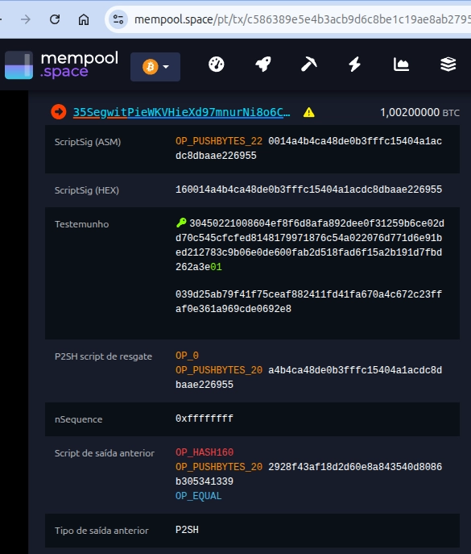

# 10 blocos marcantes da história do Bitcoin (e o que eles ensinam)

Quando alguém abre um explorador de blocos, normalmente vê apenas números crescendo. Mas alguns blocos contam histórias. Alguns mostram bugs que quase quebraram o sistema. Outros mostram mudanças de regras. Outros mostram que o Bitcoin não funciona exatamente como muita gente imagina.

Neste artigo, vamos olhar apenas 10 blocos reais da blockchain. A ideia não é apenas estudar história. É observar fenômenos reais e usar cada bloco como uma porta de entrada para entender uma peça importante do protocolo.

Sempre que possível, vamos:

- abrir na mempool.space;
- confirmar com bitcoin-cli;
- enxergar primeiro;
- explicar depois.

### Bloco 0 — O nascimento do sistema

**Altura:** 0

**Data:** 03/01/2009

**O que observar na mempool.space**

Abra o bloco 0:

[https://mempool.space/pt/block/000000000019d6689c085ae165831e934ff763ae46a2a6c172b3f1b60a8ce26f](https://mempool.space/pt/block/000000000019d6689c085ae165831e934ff763ae46a2a6c172b3f1b60a8ce26f)

Observe:

- existe apenas uma transação;
- ela não possui inputs normais;
- aparece uma mensagem dentro da coinbase.

Procure por:

> The Times 03/Jan/2009 Chancellor on brink of second bailout for banks
> 

**O que observar com bitcoin-cli**

```bash
bitcoin-cli -datadir="." getblockhash 0
000000000019d6689c085ae165831e934ff763ae46a2a6c172b3f1b60a8ce26f

bitcoin-cli -datadir="." getblock 000000000019d6689c085ae165831e934ff763ae46a2a6c172b3f1b60a8ce26f 2
```

Observe:

- campo `tx`
- única transação
- ausência de inputs convencionais

**O que esse bloco ensina**

Esse bloco apresenta três conceitos fundamentais.

**Genesis Block**

O primeiro bloco.

**Coinbase Transaction**

Transação especial que cria novas moedas.

**Dinheiro nasce dentro do consenso**

Não existe emissão fora da blockchain. Mas existe uma curiosidade. Os **50 BTC do Genesis Block nunca foram gastos**. Na prática, esse output ficou inacessível. O protocolo evoluiu assumindo esse comportamento. Se aqueles 50 BTC fossem gastos hoje, seria um dos eventos mais observados da história do Bitcoin.

### **Bloco 170 — A primeira transação entre pessoas**

**Altura:** 170

**Data:** 12/01/2009

**O que observar na mempool.space**

Abra o bloco 170 e localize a transação histórica enviada por Satoshi para Hal Finney:

[https://mempool.space/pt/block/00000000d1145790a8694403d4063f323d499e655c83426834d4ce2f8dd4a2ee](https://mempool.space/pt/block/00000000d1145790a8694403d4063f323d499e655c83426834d4ce2f8dd4a2ee)

Existe uma transação histórica:

Satoshi → Hal Finney.

Observe:

**Entrada**

```
50 BTC
```

**Saídas**

```
10 BTC → Hal Finney
40 BTC → troco retornando para Satoshi
```

Essa é considerada a primeira transferência de bitcoins entre duas pessoas diferentes. Mesmo em janeiro de 2009, já aparece uma característica importante do protocolo: o Bitcoin não movimenta "saldos". Ele consome uma saída inteira e cria novas saídas.

**O que observar com bitcoin-cli**

```bash
bitcoin-cli -datadir="." getblockhash 170
00000000d1145790a8694403d4063f323d499e655c83426834d4ce2f8dd4a2ee

bitcoin-cli -datadir="." getblock 00000000d1145790a8694403d4063f323d499e655c83426834d4ce2f8dd4a2ee 2
```

Depois:

```bash
bitcoin-cli -datadir="." getrawtransaction f4184fc596403b9d638783cf57adfe4c75c605f6356fbc91338530e9831e9e16 true
```

**O que esse bloco ensina**

Muitas pessoas imaginam que Satoshi possuía uma conta com 50 BTC e simplesmente enviou 10 BTC para Hal. Mas não foi isso que aconteceu. O que existia era um UTXO de 50 BTC.

Para enviar 10 BTC, o protocolo precisou:

1. Consumir integralmente o UTXO de 50 BTC;
2. Criar uma saída de 10 BTC para Hal Finney;
3. Criar outra saída de 40 BTC devolvendo o restante para Satoshi.

Visualmente:

```
UTXO de 50 BTC
        │
        ▼
┌─────────────────┐
│ Transação       │
└─────────────────┘
    │        │
    ▼        ▼

	10 BTC    40 BTC
	Hal       Troco
```

Esse padrão continua sendo usado em praticamente todas as transações da rede até hoje.

**Curiosidade**

Hal escreveu:

> Running bitcoin
> 

Poucas horas depois recebeu a primeira transferência.

### Bloco 74638 — O bloco dos 184 bilhões

**Altura original inválida:** 74638

**Data:** 15/08/2010

**O que observar na mempool.space**

Abra o bloco. Você verá algo estranhamente normal:

[https://mempool.space/pt/block/000000000069e1affe7161ab4bcbeacebb4ddf155b50e807f42de971b688a09b](https://mempool.space/pt/block/000000000069e1affe7161ab4bcbeacebb4ddf155b50e807f42de971b688a09b)

o explorador mostra o bloco válido. Não o bloco defeituoso.

**O que observar com bitcoin-cli**

```bash
bitcoin-cli -datadir="." getblockhash 74638
000000000069e1affe7161ab4bcbeacebb4ddf155b50e807f42de971b688a09b
```

Depois pesquise sobre o incidente.

**O que esse bloco ensina**

Em 15 de agosto de 2010, um dos bugs mais graves da história do Bitcoin foi explorado. Uma transação incluída no bloco 74638 criou duas saídas gigantescas que, somadas, ultrapassavam o limite máximo possível de bitcoins.

As saídas eram aproximadamente:

```
92.233.720.368 BTC
92.233.720.368 BTC
```

Totalizando cerca de:

```
184.467.440.737 BTC
```

Muito acima do limite de 21 milhões definido pelo protocolo. O problema estava em uma falha de validação conhecida como **integer overflow** (ou value overflow).

Na época, o software verificava individualmente se cada saída possuía um valor válido, mas não validava corretamente a soma de todas as saídas da transação. Durante essa soma ocorreu um overflow numérico, fazendo o resultado parecer pequeno e válido para o código.

Na prática, a rede aceitou temporariamente uma transação que criava bitcoins do nada. Poucas horas depois, Satoshi Nakamoto e outros desenvolvedores lançaram uma correção emergencial. Os nodes atualizaram o software e passaram a rejeitar aquela transação inválida.

A consequência foi uma reorganização da blockchain: a cadeia que continha o bloco defeituoso foi abandonada e substituída por outra que não continha a criação indevida de moedas.

É por isso que, ao consultar hoje a altura 74638 em um explorador de blocos, você não encontra o bloco com os 184 bilhões de BTC. O que aparece é o bloco válido que acabou vencendo após a correção.

**Curiosidade**

Esse incidente é um dos raros exemplos de uma falha que ameaçou diretamente a política monetária do Bitcoin. Se não tivesse sido corrigido rapidamente, o limite de 21 milhões poderia ter perdido completamente sua credibilidade ainda em 2010.

Imagine que o bug tivesse permanecido despercebido por vários dias. Quanto maior fosse o número de blocos construídos sobre a cadeia inválida, mais difícil seria coordenar uma reorganização para removê-la. O episódio mostra que a segurança do Bitcoin depende não apenas da criptografia, mas também da correta implementação das regras de consenso.

### **Blocos 209999 → 210000 — O dia em que o relógio virou**

**Alturas:** 209999 e 210000

**Data:** 28/11/2012

**O que observar na mempool.space**

Abra os blocos 209999 e 210000 lado a lado:

[https://mempool.space/pt/block/00000000000000f3819164645360294b5dee7f2e846001ac9f41a70b7a9a3de1](https://mempool.space/pt/block/00000000000000f3819164645360294b5dee7f2e846001ac9f41a70b7a9a3de1)

[https://mempool.space/pt/block/000000000000048b95347e83192f69cf0366076336c639f9b7228e9ba171342e](https://mempool.space/pt/block/000000000000048b95347e83192f69cf0366076336c639f9b7228e9ba171342e)

A primeira vista eles parecem normais. Ambos possuem transações, ambos foram minerados normalmente e ambos fazem parte da mesma cadeia. Mas existe uma diferença importante na transação coinbase.

Ao abrir o bloco **209999**, observe a recompensa do minerador:

```
50 BTC + taxas
```

Agora abra o bloco seguinte, **210000**. A recompensa passa para:

```
25 BTC + taxas
```

Nenhuma votação ocorreu. Nenhum administrador apertou um botão. Nenhum minerador escolheu reduzir sua própria receita. A mudança simplesmente aconteceu porque o protocolo determinava que, após 210.000 blocos, a emissão seria reduzida pela metade.

É uma das poucas situações em que uma regra econômica inteira pode ser observada olhando apenas dois blocos consecutivos.

---

**O que esse bloco ensina**

O Bitcoin possui uma política monetária programada. Novas moedas entram em circulação através da recompensa paga aos mineradores, conhecida como **subsídio**.

Durante os primeiros anos da rede, cada bloco criava:

```
50 BTC
```

Após o bloco 209999, a regra mudou automaticamente para:

```
25 BTC
```

Esse evento ficou conhecido como o primeiro **halving**. A partir daí, a emissão passou a seguir uma sequência previsível:

```
50 BTC
25 BTC
12,5 BTC
6,25 BTC
3,125 BTC
...
```

Até que, em algum momento no próximo século, novos bitcoins deixarão de ser emitidos. O mais interessante é que essa redução não depende da vontade de governos, bancos centrais ou empresas. Ela já estava escrita no software desde o início.

---

**Curiosidade**

Se você estivesse acompanhando a rede naquele dia, não veria nenhuma mudança visual dramática. Os blocos continuaram chegando normalmente. As transações continuaram sendo confirmadas. O único sinal de que algo histórico havia acontecido estava escondido dentro da transação coinbase do bloco 210000.

### Bloco 363724 — O dia em que assinaturas ambíguas deixaram de valer

**Altura:** 363724

**Data:** 03/07/2015

**O que observar na mempool.space**

Abra o bloco 363724 e navegue por algumas transações:

[https://mempool.space/pt/block/00000000000000000fb32e0d606a42615d44d93449a36ba64ee018de6009f898](https://mempool.space/pt/block/00000000000000000fb32e0d606a42615d44d93449a36ba64ee018de6009f898)

Ao abrir uma transação dessa época, você verá que os dados de assinatura ainda aparecem dentro do campo `scriptSig`, já que o SegWit só seria ativado dois anos depois.

O conteúdo parece uma sequência longa de bytes em hexadecimal, algo parecido com:

```
3045022100...
```

Para quem olha rapidamente, parece apenas mais um detalhe técnico. Mas foi justamente a forma como essas assinaturas eram codificadas que motivou a ativação do BIP66.

---

**O que esse bloco ensina**

Assinar uma transação não é suficiente. Todos os nodes também precisam concordar sobre como essa assinatura será representada. Nos primeiros anos do Bitcoin, diferentes bibliotecas aceitavam pequenas variações na codificação de assinaturas ECDSA. Embora isso não permitisse criar moedas do nada ou gastar bitcoins de terceiros, introduzia ambiguidades que não deveriam existir em um sistema de consenso global.

O BIP66 introduziu uma nova regra exigindo que todas as assinaturas seguissem rigorosamente o formato **DER (Distinguished Encoding Rules)**. Na prática, o objetivo não era mudar a criptografia utilizada pelo Bitcoin, mas garantir que todos os participantes da rede interpretassem exatamente os mesmos dados da mesma forma.

Pode parecer um detalhe pequeno, mas sistemas distribuídos costumam falhar justamente nos detalhes. Ao tornar as regras mais rígidas, o Bitcoin reduziu uma série de comportamentos inesperados e deu mais um passo na direção de um consenso mais previsível.

---

**Curiosidade**

Pouco depois da ativação do BIP66, ocorreu uma pequena reorganização da blockchain. Alguns mineradores estavam sinalizando suporte à nova regra sem efetivamente validá-la corretamente. Quando um bloco incompatível foi produzido, parte da rede o aceitou e outra parte o rejeitou, resultando em uma reorg temporária. O episódio mostrou que sinalizar suporte a uma atualização é diferente de realmente aplicar suas regras.

### Bloco 481824 — O bloco que mudou a estrutura das transações

**Altura:** 481824

**Data:** 23/08/2017

**O que observar na mempool.space**

Abra o bloco 481824:

[https://mempool.space/pt/block/0000000000000000001c8018d9cb3b742ef25114f27563e3fc4a1902167f9893](https://mempool.space/pt/block/0000000000000000001c8018d9cb3b742ef25114f27563e3fc4a1902167f9893)

Ao abrir o bloco 481824, procure a transação:

```bash
c586389e5e4b3acb9d6c8be1c19ae8ab2795397633176f5a6442a261bbdefc3a
```

Ela é considerada uma das primeiras transações SegWit confirmadas após a ativação. Ao abrir os detalhes, observe algo que não existia em transações anteriores:

```bash
Testemunho (Witness)
```

Na imagem abaixo, o campo Witness aparece separado do ScriptSig.



Antes do SegWit, as assinaturas ficavam inteiramente dentro do ScriptSig. Agora parte dessas informações passa a ser armazenada em uma nova estrutura chamada Witness. Essa separação parece pequena, mas mudou profundamente a forma como o Bitcoin organiza e valida transações.

A própria mempool.space evidencia essa mudança ao exibir métricas como **Weight** e **Virtual Size (vsize)**, conceitos que surgiram justamente com o SegWit. À primeira vista parece apenas uma reorganização dos dados da transação. Na prática, foi uma das maiores mudanças já realizadas no protocolo sem exigir uma ruptura da rede.

---

**O que esse bloco ensina**

Nos primeiros anos do Bitcoin, as assinaturas faziam parte da própria estrutura principal da transação. Isso criava algumas limitações. A mais conhecida era a chamada **transaction malleability**, uma situação em que determinados detalhes da transação podiam ser alterados sem modificar seu efeito econômico. Os bitcoins continuavam indo para os mesmos lugares, mas o identificador da transação podia mudar.

Essa característica dificultava a construção de protocolos mais sofisticados sobre o Bitcoin. O SegWit resolveu esse problema movendo as assinaturas para uma área separada chamada Witness. As regras de validação continuaram as mesmas. Os bitcoins continuaram sendo protegidos pelas mesmas chaves. Mas a organização dos dados mudou.

Essa mudança permitiu que o protocolo calculasse o identificador principal da transação sem depender das assinaturas, eliminando a principal fonte de malleability. Ao mesmo tempo, o SegWit introduziu uma nova forma de medir o espaço consumido dentro dos blocos. Em vez de trabalhar apenas com tamanho em bytes, o protocolo passou a utilizar o conceito de **weight**, atribuindo pesos diferentes para diferentes partes da transação. O resultado foi um aumento efetivo da capacidade dos blocos sem alterar o limite tradicional de 1 MB da forma como muitas pessoas imaginavam.

---

**Curiosidade**

Quando o SegWit foi proposto, muitas discussões giravam em torno da capacidade dos blocos. Mas, olhando em retrospecto, talvez seu impacto mais importante tenha sido criar a base técnica para diversas inovações posteriores.

Sem o SegWit, projetos como a Lightning Network teriam encontrado muito mais dificuldades para existir de forma segura.

### Bloco 501726 — O bloco que não criou dinheiro

**Altura:** 501726

**Data:** 30/12/2017

**O que observar na mempool.space**

Abra os blocos **501726** e **501728** lado a lado:

[https://mempool.space/pt/block/0000000000000000004b27f9ee7ba33d6f048f684aaeb0eea4befd80f1701126](https://mempool.space/pt/block/0000000000000000004b27f9ee7ba33d6f048f684aaeb0eea4befd80f1701126)

[https://mempool.space/pt/block/00000000000000000013460c16ffa09553e9739aebbd467d7bf34284f2dd5134](https://mempool.space/pt/block/00000000000000000013460c16ffa09553e9739aebbd467d7bf34284f2dd5134)

À primeira vista eles parecem praticamente iguais. Ambos possuem apenas uma transação: a coinbase do minerador. Ambos foram minerados normalmente. Ambos foram aceitos pela rede.

Mas ao observar a recompensa da coinbase aparece uma diferença curiosa. No bloco **501728**, o minerador reivindicou toda a recompensa disponível para aquele momento:

```
12,5 BTC
```

Já no bloco **501726**, a coinbase possui:

```
0,00000000 BTC
```

A própria mempool.space exibe:

```
Subsídio + taxas: 0,00 BTC
```

e a única transação do bloco mostra:

```
Conteúdo no bloco (Moedas Recém-Geradas)
0,00000000 BTC
```

Em outras palavras, o bloco foi minerado, propagado e validado pela rede sem criar nenhuma nova moeda.

---

**O que esse bloco ensina**

Muitas pessoas imaginam que a recompensa de um bloco é criada automaticamente pelo protocolo. Mas não é exatamente assim. O protocolo apenas define o valor máximo que pode ser criado em cada altura da blockchain.

Na época desse bloco, o limite era:

```
12,5 BTC + taxas
```

O consenso impede que um minerador crie mais do que esse valor. Por outro lado, não existe nenhuma regra obrigando o minerador a reivindicar toda a recompensa disponível. O bloco 501726 demonstra isso de forma extrema.

Em vez de criar os 12,5 BTC permitidos, a coinbase criou:

```
0 BTC
```

O resultado é que esses bitcoins nunca passaram a existir. Não foram enviados para um endereço inacessível. Não foram queimados. Não foram perdidos posteriormente. Eles simplesmente jamais foram emitidos.

---

**Curiosidade**

Quando falamos que o Bitcoin possui um limite de 21 milhões de moedas, estamos falando de um limite máximo teórico. Na prática, a quantidade efetivamente emitida será um pouco menor.

Existem diversos blocos ao longo da história em que mineradores deixaram de reivindicar parte da recompensa disponível. O bloco 501726 é provavelmente o exemplo mais radical: um bloco válido que não criou absolutamente nenhum bitcoin.

### Bloco 709632 — O primeiro bloco Taproot

**Altura:** 709632

**Data:** 14/11/2021

**O que observar na mempool.space**

Abra o bloco 709632:

[https://mempool.space/pt/block/0000000000000000000687bca986194dc2c1f949318629b44bb54ec0a94d8244](https://mempool.space/pt/block/0000000000000000000687bca986194dc2c1f949318629b44bb54ec0a94d8244)

Diferentemente do SegWit, cuja ativação introduziu elementos visuais bastante evidentes como o campo Witness, o Taproot chega de forma mais discreta.

Uma boa forma de enxergar a novidade é abrir uma transação desse bloco:

[https://mempool.space/pt/tx/e700b7b330e4b56c5883d760f9cbe4fa47e0f62b350e108f1767bc07a4bbc07b?showDetails=true](https://mempool.space/pt/tx/e700b7b330e4b56c5883d760f9cbe4fa47e0f62b350e108f1767bc07a4bbc07b?showDetails=true)

Ao analisar suas saídas, aparece algo que nunca havia existido na blockchain até então:

```bash
Tipo: V1_P2TR
```

Além disso, o ScriptPubKey assume uma forma bastante diferente dos scripts tradicionais:

```bash
OP_PUSHNUM_1
OP_PUSHBYTES_32
```

Na prática, estamos vendo os primeiros outputs Taproot aceitos pela rede Bitcoin. A figura abaixo mostra duas dessas saídas presentes na transação.


Para a maioria dos usuários, nada parecia ter mudado naquele dia. Carteiras continuaram funcionando normalmente, blocos continuaram sendo minerados e transações continuaram sendo confirmadas. Mas, internamente, o Bitcoin havia acabado de ganhar uma nova linguagem para representar condições de gasto.

---

**O que esse bloco ensina**

O Taproot foi a maior atualização de consenso desde o SegWit. Seu objetivo não era aumentar o tamanho dos blocos nem alterar a política monetária do Bitcoin. A mudança estava relacionada principalmente à forma como scripts e assinaturas são representados e verificados.

Antes do Taproot, diferentes tipos de gastos frequentemente deixavam rastros distintos na blockchain. Um observador conseguia identificar com relativa facilidade se determinada saída estava associada a um gasto simples, uma multisig ou um script mais complexo.

Com o Taproot, muitas dessas estruturas passaram a parecer iguais quando observadas na blockchain. Diversos tipos de gastos agora podem ser representados da mesma forma, revelando detalhes apenas quando realmente necessário.

A atualização também introduziu as assinaturas **Schnorr**, que passaram a coexistir com as tradicionais assinaturas ECDSA utilizadas pelo Bitcoin desde os primeiros blocos.

Para quem apenas envia e recebe bitcoins, a diferença é quase invisível. Para desenvolvedores, porém, o Taproot abriu espaço para construções mais eficientes, mais privadas e potencialmente mais complexas sobre a mesma base de consenso.

O bloco 709632 marca exatamente o momento em que essas novas regras passaram a fazer parte do protocolo.

---

**Curiosidade**

Ao contrário do primeiro halving, do bug dos 184 bilhões de bitcoins ou da ativação do SegWit, o Taproot quase não deixou marcas visuais evidentes para quem observava a blockchain naquele dia.

Talvez essa seja justamente a parte mais interessante. Uma das maiores atualizações já realizadas no Bitcoin foi ativada sem interromper a rede, sem criar uma nova moeda e sem alterar a experiência da maioria dos usuários. A única pista estava escondida em detalhes aparentemente simples, como o surgimento do tipo:

```bash
V1_P2TR
```

nas transações daquele bloco.

### Bloco 840000 — O dia em que as taxas venceram a emissão

**Altura:** 840000

**Data:** 19/04/2024

**O que observar na mempool.space**

Abra o bloco 840000:

[https://mempool.space/pt/block/0000000000000000000320283a032748cef8227873ff4872689bf23f1cda83a5](https://mempool.space/pt/block/0000000000000000000320283a032748cef8227873ff4872689bf23f1cda83a5)

Logo na transação coinbase aparece algo que durante muitos anos parecia improvável. A recompensa total recebida pelo minerador foi:

```bash
40,75061499 BTC
```

Ao analisar os detalhes do bloco, percebemos de onde veio esse valor:

```bash
Subsídio:   3,125 BTC
Taxas:     37,626 BTC
Total:     40,75061499 BTC
```

Ou seja, mais de 92% da receita do minerador naquele bloco veio das taxas pagas pelos usuários. O subsídio, que durante grande parte da história do Bitcoin foi a principal fonte de receita dos mineradores, tornou-se apenas uma pequena parcela da recompensa total.

Basta olhar para os números para perceber algo curioso:

```bash
37,626 BTC > 3,125 BTC
```

As taxas não apenas complementaram a emissão. Elas a superaram por uma margem enorme.

---

**O que esse bloco ensina**

Quando o Bitcoin foi lançado, cada bloco criava 50 BTC. Naquele período, praticamente toda a receita dos mineradores vinha da emissão de novas moedas. As taxas existiam, mas representavam uma parcela muito pequena da recompensa total.

O bloco 840000 mostra um cenário completamente diferente. Poucos minutos antes dele ser minerado, ocorreu o quarto halving da história do Bitcoin. A recompensa fixa caiu de:

```bash
6,25 BTC
```

para:

```bash
3,125 BTC
```

Ao mesmo tempo, a disputa por espaço nos blocos atingiu níveis extraordinários. O resultado foi que os usuários pagaram coletivamente mais de 37 BTC em taxas para entrar naquele bloco.

Pela primeira vez, milhões de pessoas puderam observar de forma concreta algo que durante anos aparecia apenas em discussões teóricas sobre a sustentabilidade da mineração. A segurança do Bitcoin não depende apenas da emissão monetária. Ela também pode ser financiada pelo mercado de taxas. O bloco 840000 é uma das demonstrações mais claras dessa ideia já registradas na blockchain.

---

**Curiosidade**

Se alguém observasse apenas a coinbase desse bloco sem conhecer seu contexto histórico, provavelmente concluiria que a recompensa de mineração era de aproximadamente 40 BTC.

Na realidade, apenas:

```bash
3,125 BTC
```

foram criados naquele bloco.

Os outros:

```bash
37,626 BTC
```

vieram de usuários competindo por espaço na blockchain.

É uma pequena amostra de como poderá funcionar a economia da mineração nas próximas décadas, quando o subsídio continuar diminuindo a cada halving.

### Bloco 927474 — A loteria da mineração

**Altura:** 927474

**Data:** 11/12/2025

**O que observar na mempool.space**

Abra o bloco:

[https://mempool.space/pt/block/000000000000000000001ac9929c4d1aa62610efe8dd18837fdf445b3c47f5cf](https://mempool.space/pt/block/000000000000000000001ac9929c4d1aa62610efe8dd18837fdf445b3c47f5cf)

À primeira vista ele parece um bloco completamente comum. Foi minerado normalmente, possui milhares de transações e uma recompensa total próxima de:

```bash
3,133 BTC
```

Ao observar os detalhes, porém, aparece um dado curioso:

```
Minerador: Solo CK
```

Isso significa que o bloco não foi encontrado por uma grande pool como Foundry, AntPool ou ViaBTC. Ele foi encontrado por um minerador solo utilizando a infraestrutura da CK Pool.

Na própria visualização da mempool.space, o bloco aparece cercado por blocos minerados por grandes pools da indústria. No meio deles surge um único bloco marcado como **Solo CK**, revelando algo que muitas pessoas acreditam ser impossível nos dias atuais: um minerador individual encontrando sozinho um bloco válido do Bitcoin.

---

**O que esse bloco ensina**

É comum imaginar que a mineração funciona como uma corrida em que o equipamento mais poderoso sempre vence. Na prática, ela funciona mais como uma loteria. Cada tentativa de hash representa um bilhete. Quem possui mais poder computacional compra mais bilhetes por segundo e, consequentemente, possui mais chances de encontrar um bloco.

Mas possuir mais bilhetes não garante vitória em uma rodada específica. O bloco 927474 demonstra exatamente isso. Segundo Con Kolivas, desenvolvedor da CK Pool, o minerador responsável operava com aproximadamente:

```bash
270 TH/s
```

Para efeito de comparação, grandes pools controlam centenas de exahashes por segundo, ou seja, milhões de vezes mais poder computacional. Mesmo assim, aquele minerador encontrou um bloco válido e recebeu toda a recompensa. Kolivas comentou que um equipamento desse porte possuía aproximadamente:

```
1 chance em 30.000 por dia
```

de encontrar um bloco.

Em outras palavras, a expectativa estatística era algo próximo de:

```
1 bloco a cada 82 anos
```

Mas a mineração não funciona por agendamento. Cada tentativa é independente da anterior. Eventos improváveis continuam sendo possíveis. E, ocasionalmente, acontecem.

---

**Curiosidade**

A recompensa daquele bloco foi superior a 3 BTC, o que correspondia a aproximadamente R$ 1,5 milhão na época. É por isso que muitos veículos especializados compararam o episódio a ganhar na loteria.

A analogia não é perfeita, mas ajuda a entender a ideia central: mesmo com uma probabilidade extremamente pequena, ainda existe a possibilidade de encontrar um bloco. E o protocolo trata exatamente da mesma forma um bloco encontrado por uma fazenda industrial e um bloco encontrado por um único minerador.

---

A blockchain do Bitcoin já ultrapassou centenas de milhares de blocos, mas alguns deles acabam se tornando janelas privilegiadas para entender o funcionamento do protocolo.

Ao longo deste artigo vimos o nascimento da rede no bloco Genesis, a primeira transferência entre pessoas, um bug que ameaçou a política monetária, o primeiro halving, mudanças importantes nas regras de consenso, a chegada do SegWit e do Taproot, um bloco que não criou nenhuma moeda, um exemplo da natureza probabilística da mineração e um momento em que as taxas superaram a própria emissão monetária.

O mais interessante é que nenhum desses conceitos precisou ser explicado apenas por diagramas ou teoria. Todos eles podem ser observados diretamente na blockchain. Basta abrir um explorador, inspecionar uma transação ou analisar uma coinbase para encontrar evidências concretas de como o Bitcoin realmente funciona.

Talvez essa seja uma das características mais fascinantes do protocolo. Diferentemente de muitos sistemas complexos, quase tudo o que acontece no Bitcoin deixa rastros públicos e verificáveis.

por: Rafael Santos
