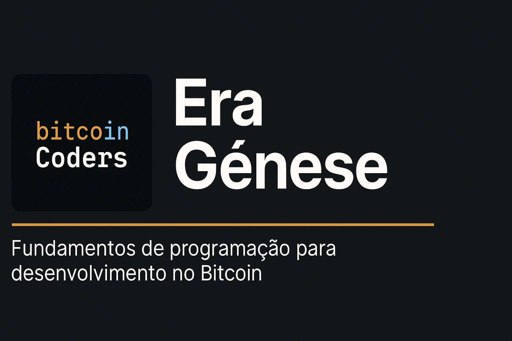

# 🧬 Era Gênese  
> Fundamentos técnicos para o desenvolvimento no ecossistema Bitcoin.



---

## 🌍 Visão Geral

A **Era Gênese** marca o início da jornada do desenvolvedor Bitcoin Coders.  
Aqui construímos a base técnica necessária para compreender e criar aplicações que utilizam os princípios fundamentais do Bitcoin — de representações numéricas e criptografia, até sistemas distribuídos e protocolos de consenso.

O foco não é aprender “programação básica”, mas sim **entender os fundamentos computacionais que tornam o Bitcoin possível**.

---

## 🧱 Estrutura da Era

```text
era-genese/
├── artigos/
│   ├── 01-transformacoes-de-base.md
│   ├── 02-criptografia-aplicada.md
│   ├── 03-estruturas-de-dados.md
│   ├── 04-programacao-concorrente.md
│   ├── 05-redes-p2p.md
│   └── 06-sistemas-distribuidos.md
├── videos/
│   ├── roteiro-01-transformacoes-de-base.md
│   ├── roteiro-02-criptografia-aplicada.md
│   └── (...)
├── bitups/
│   ├── bitup-01-bases-numericas/
│   ├── bitup-02-hashes-e-checksums/
│   ├── bitup-03-criptografia-simples/
│   └── (...)
├── scripts/
│   ├── python/
│   │   ├── convert_base58.py
│   │   ├── checksum_sha256.py
│   │   └── bech32_encoder.py
│   └── c/
│       ├── hash_manual.c
│       └── p2p_socket_demo.c
└── recursos/
    ├── imagens/
    ├── slides/
    └── referencias.md
```

> *Dica:* use o bloco de código acima (com \`\`\`text) para manter os caracteres da árvore perfeitos no GitHub.

---

## 🧩 Temas Principais

| Tema | Descrição |
|------|------------|
| 🔢 **Representação e Transformações de Bases Numéricas** | Como números são representados em diferentes sistemas (binário, hexadecimal, base58, bech32) e sua importância na codificação de endereços e chaves. |
| 🔐 **Criptografia Aplicada** | Conceitos de hash, assinaturas digitais, funções unidirecionais e verificações de integridade aplicadas ao contexto do Bitcoin. |
| 🧮 **Estruturas de Dados e Algoritmos para Blockchain** | Modelagem de blocos, transações, árvores de Merkle e estruturas eficientes para validação de dados. |
| ⚙️ **Programação Concorrente e Assíncrona** | Threads, processos, filas e modelos de execução paralela para simular redes descentralizadas. |
| 🌐 **Redes P2P e Protocolos de Comunicação** | Como nós da rede se comunicam, trocam blocos e transações e mantêm consistência no sistema. |
| 🧠 **Sistemas Distribuídos e Consenso** | Fundamentos teóricos e práticos dos algoritmos de consenso (como Proof of Work) e sincronização de estados. |

---

## 🚀 BitUps (Workshops da Gênese)

Os **BitUps** desta Era são encontros ao vivo realizados mensalmente, com foco em teoria aplicada e prática guiada.

**Exemplos:**
- **BitUp #1 – Da Base Decimal ao Bech32**: Conversões e codificações numéricas aplicadas a endereços.
- **BitUp #2 – Hashes e Integridade de Dados**: SHA256, checksum duplo e verificações.
- **BitUp #3 – Estruturas de Dados para Blockchain**: Blocos, transações e Merkle em Python.
- **BitUp #4 – Simulando Comunicação P2P**: Sockets e troca de mensagens entre nós.

📅 Agenda e inscrições: **bitcoincoders.org/bitups**

---

## 🧠 Objetivo Final

Ao concluir a **Era Gênese**, você será capaz de:
- Compreender como o Bitcoin se sustenta em fundamentos computacionais.
- Implementar simulações de estruturas e processos típicos de uma blockchain.
- Ler e interpretar representações numéricas e criptográficas comuns no Bitcoin.
- Iniciar a prática de desenvolvimento na **Era Satoshi**.

---

## 🤝 Apoiado por

O **Bitcoin Coders** é uma iniciativa educacional e aberta, **apoiada pela [Área Bitcoin](https://areabitcoin.com.br)**.

---

© 2025 Bitcoin Coders — código aberto, aprendizado livre.
